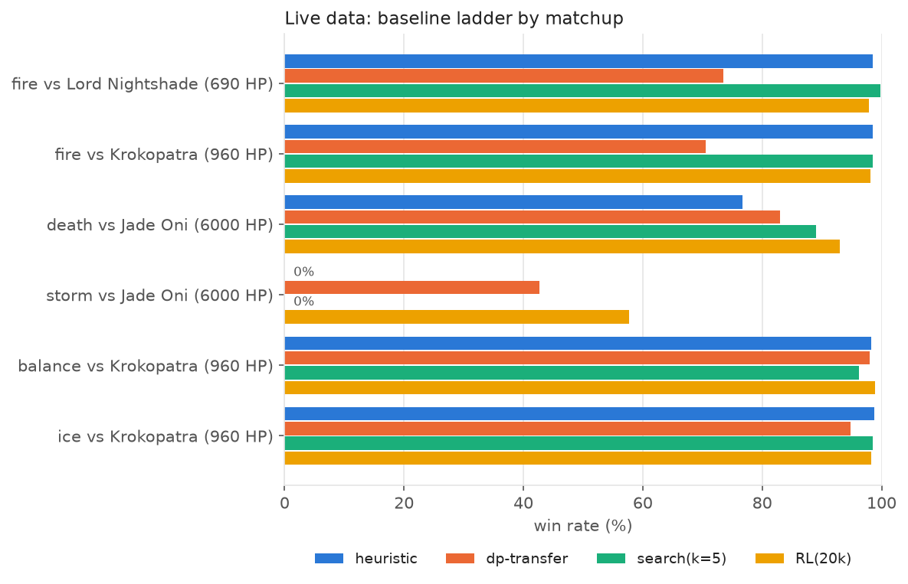
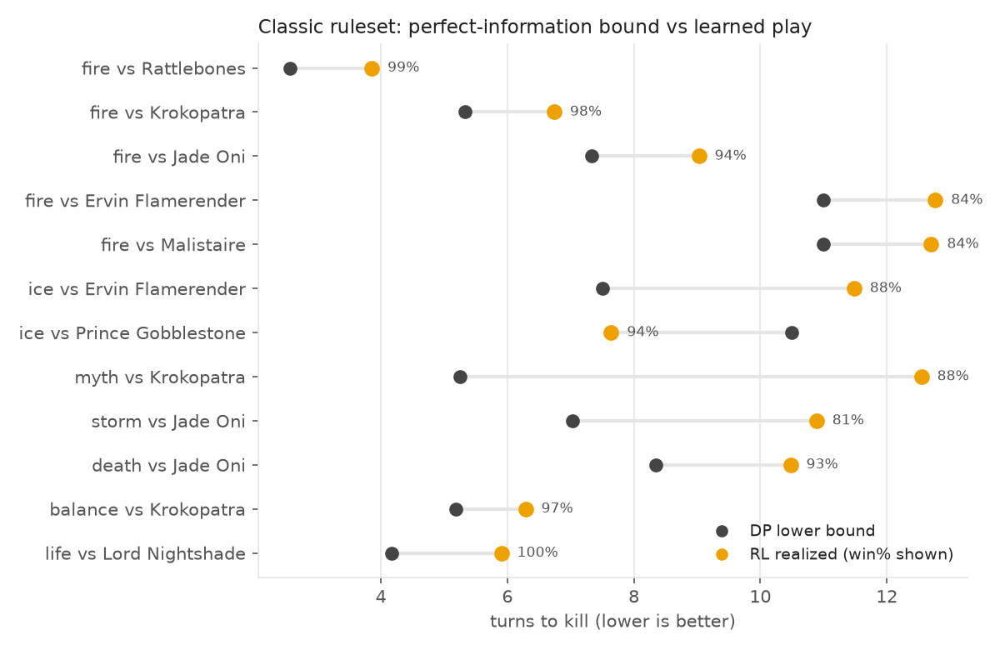
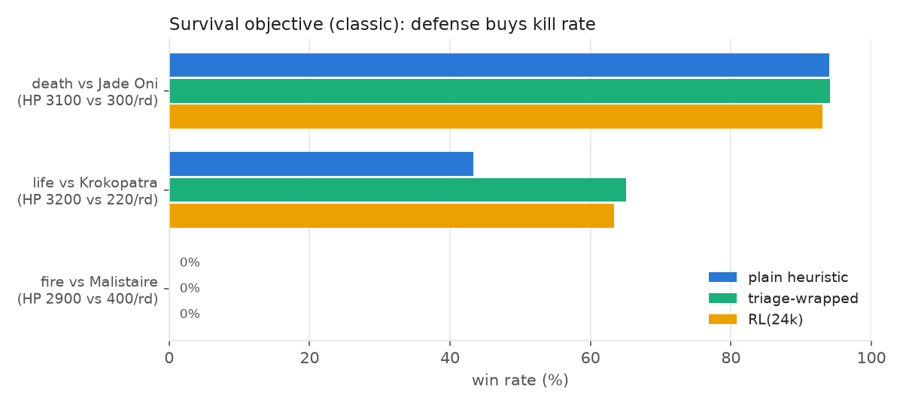
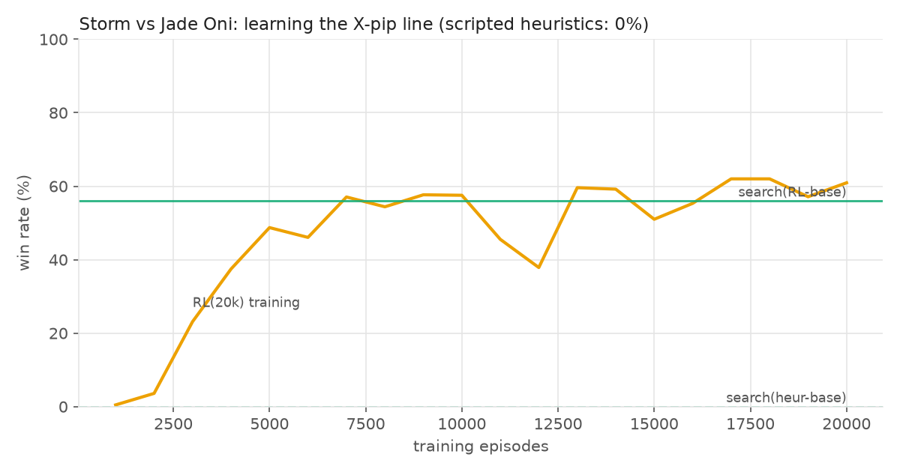
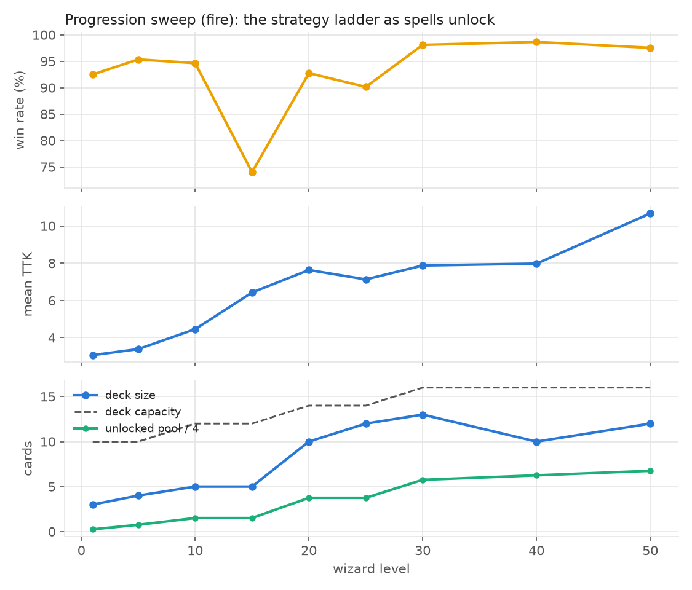
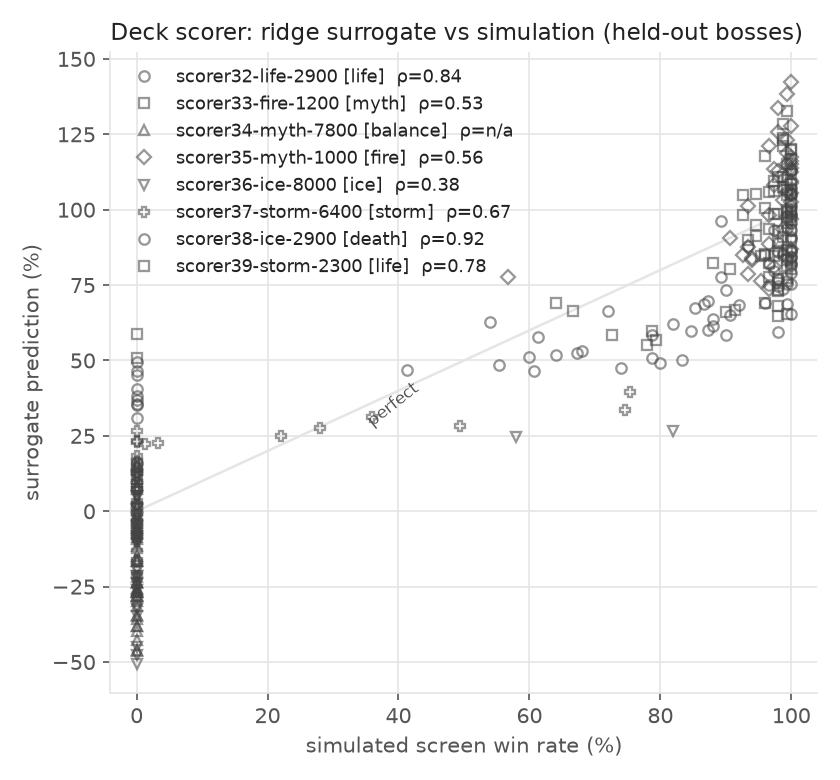
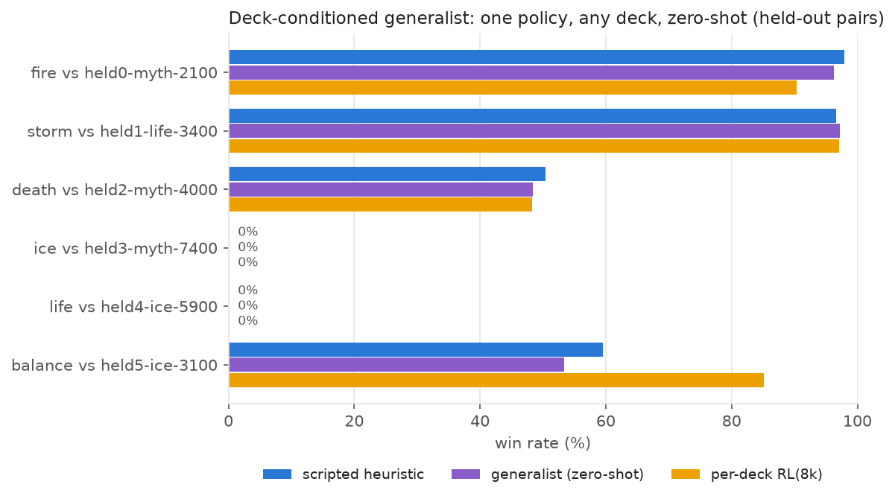
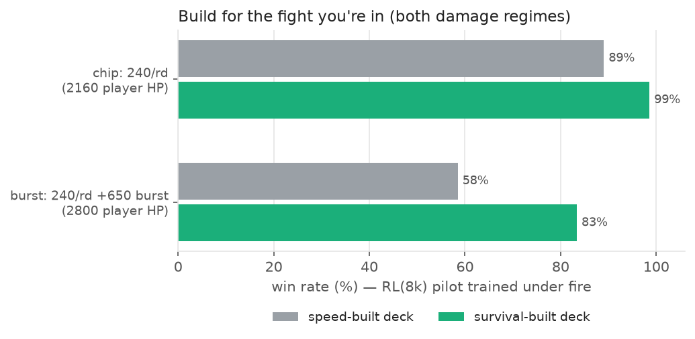

# W101 combat lab: heuristics → exact DP → RL

Turns-to-kill (TTK) and survival study of Wizard101 PvE combat: how much of
the blade-stack meta falls out of the raw card math, and what a learner adds
on top. The v0.3 simulator follows the design notes in
`docs/RESEARCH.md`: a **rules engine plus structured symbolic state**, with
effect provenance as a first-class citizen.

## Pipeline

| file | role |
|---|---|
| `scrape_central_wiki.py` | (run locally) refresh `cards_clean.json` from the wiki |
| `scrape_creatures.py` | (run locally) creature pages → `creatures_clean.json` via the MediaWiki API: descriptive UA, ≥1 s throttle, `maxlag`, resumable, `cloudscraper` fallback, and a `--from-xml` mode for browser-downloaded `Special:Export` dumps when Cloudflare blocks scripts. 403 = block, never retried |
| `spells_full.json` / `bosses_clean.json` | full scraped datasets: 18k spell records with game-data effect primitives (typed effects, params, targets, provenance variants) and 1.9k bosses with real stats (health, school, resist/boost, stunable, cheat notes) |
| `data_full.py` | loaders for the full datasets under the **`w101-pve-live-scrape`** ruleset: effect-id map derived by cross-referencing documented spells, provenance from the variant field (`core`/`treasure`/`wand`/`amulet`/`pet` → stack sources), classic-average backfill for range-damage spells the dump doesn't carry (tagged `backfilled-avg`), undecoded effects skipped with reasons — 4.6k usable cards, `LIVE_DECKS` built from game names (the wiki scrape's "Fire Shark"/"Ice Snake" turn out not to exist; "Elemental Blade" is game-named **Tri Blade**) |
| `experiment_full.py` | the live-data table (`results_live.json`): DP-LB, heuristics, DP-transfer, search, RL on real boss stats |
| `content.py` | curated effect primitives (the `spell_effects` layer): DoT splits, multi-hit components, drains, prisms, absorbs, per-pip spells, dispels, summons — each entry confidence-tagged (`community`/`approx`/`inferred`), unsupported cards excluded instead of mis-modeled |
| `w101_sim.py` | v0.3 engine: structured hanging effects with **(name, source) stack keys**, FIFO ward pass with prism school conversion, shields/weaknesses/mantles/dispels/absorbs, scheduled DoTs/HoTs (snapshot at cast), drains, X-pip spells, multi-hit link groups, AoE with per-target resolution, stuns + stun blocks, threat-driven enemy targeting, minions, boss **cheat-script hooks**, treasure-card sideboard, crit/block/pierce machinery, version-tagged `Rules` |
| `bosses.py` | preset enemy registry + illustrative cheat scripts + candidate decks for **all seven schools** |
| `dp_solver.py` | value iteration on the deck-free abstraction (distinct-buff configs, ward charge states, X-pip actions) = perfect-information lower bound; decks that lean on unmodeled mechanics (prisms/heals/shields) are flagged via `meta['unmodeled']` |
| `rl_agent.py` | tabular Q-learning (backward MC returns, DP warm-start, scarcity-aware state incl. drains and prisms) + UCB deck-selection bandit per boss |
| `search_policy.py` | belief-state baseline: determinized rollout search over the hidden draw order (deck composition is known, order isn't — the POMDP move). No training, interpretable, sits between heuristics and RL |
| `experiment.py` | the headline tables (`results.json`): speed (immortal player) + survival (real boss damage) |
| `tests/test_sim.py` | 70 mechanics tests, one per documented combat rule |
| `tests/test_properties.py` | invariants that guard the ML results: blade/pierce monotonicity, deck + ward-charge conservation, seed → identical event log, damage-bound dominance, no-impossible-kill |

## Engine rules worth knowing (v0.3)

- **Provenance stacking.** A deck Fireblade, a treasure-card `Fireblade@tc`
  and a `Sharpened Fireblade` all stack with each other; a second copy of
  the *same* one is an illegal cast, like the in-game X. This is the
  research doc's "if you only run one ablation, run no-effect-provenance"
  representation, implemented at the engine level.
- **FIFO ward processing with a running school.** Traps placed *before* a
  prism boost the hit, then the prism converts it and the *converted*
  school meets resist; traps placed after the prism strand. One strike
  consumes **all** matching charms and wards at once.
- **Link groups.** Fire Elf's 50 + DoT is one strike (a single Tower Shield
  halves both portions); Minotaur's 50-then-445 are separate groups, so the
  50-hit strips shields and blades before the payload lands — the classic
  shield-breaker play.
- **DoTs/HoTs snapshot at cast**; drains ignore heal modifiers; absorbs
  soak ticks; fizzles now **discard the card** but keep pips
  (community-confirmed; the v0.2 retry-forever rule inflated kill rates and
  is available as `Rules(fizzle_discards_card=False)`).
- **Cheats** are per-boss scripted interrupts (`after_player_cast` /
  `round_start` / `hp_below`) executing free effect ops — the "rules engine
  plus cheat scripts" pattern. The bundled scripts are illustrative shapes,
  not scraped encounters.
- **Out of scope, declared:** criticals default off in the classic
  era but are a shipped ruleset (`rulesets.CRIT_ERA`, rating-based and
  MODELED), as is the mastery amulet (`Rules.mastery_school`) and
  archmastery/school pips (`Rules.archmastery` — a real resource with
  its own rack slots and an own-school spend lock). Still absent:
  shadow pips, and any full gear/pet stat layer (the fields exist and
  default to 0, including flat damage/flat resist; `rulesets.
  stats_for(..., school_gear=True)` supplies a MODELED own-school
  damage bonus for era probes). Enemy decks are flat scripted
  hits + cheats by default, or a configured spell pool with archetype
  AI (`Boss(pool=...)`). Beguile is the one card excluded as
  unsupported.
- **Auditable + versioned.** `Sim(log_events=True)` records a structured
  event log per duel (`cast_declared`, `charm_consumed`, `ward_consumed`,
  `prism_converted`, `damage_applied`, `dot_created`, `cheat_fired`, ...):
  same seed ⇒ identical log, and every evaluation is stamped with
  `Rules.ruleset_id` (`w101-pve-classic-0.3`) so numbers from different
  rule versions never mix. `max_remaining_damage()` gives an optimistic
  bound on what the remaining deck can still deliver — the scarcity
  feature and the `provably_unwinnable()` classifier in one.

## Headline results (v0.3 rules)

Speed objective (immortal player = pure TTK; RL kill% in parens; heuristic
column is the best "stack k buffs → nuke" that clears 95% kill):

```
matchup                      DP-LB       RL (kill%)   best heuristic
fire  vs Rattlebones          2.57     3.86 ( 99%)      2.78
fire  vs Krokopatra           5.33     6.74 ( 98%)      6.75
fire  vs Jade Oni             7.33     9.03 ( 94%)        —
fire  vs Ervin Flamerender   11.00    12.77 ( 84%)        —
fire  vs Malistaire          11.00    12.70 ( 84%)        —
ice   vs Ervin Flamerender    7.50    11.48 ( 88%)     11.36
ice   vs Prince Gobblestone  10.50*    7.64 ( 94%)      7.01
myth  vs Krokopatra           5.25*   12.55 ( 88%)        —
storm vs Jade Oni             7.03    10.89 ( 81%)        —
death vs Jade Oni             8.35    10.48 ( 93%)        —
balance vs Krokopatra         5.19     6.29 ( 97%)      8.75
life  vs Lord Nightshade      4.17     5.91 (100%)      5.05
```

`*` = the DP abstraction doesn't cover the deck's key mechanic, and it
shows — in both directions:

- **Ice vs Gobblestone: RL beats the "lower bound".** The bound only holds
  inside the blade/trap/nuke abstraction; the prism deck escapes it
  (ice → fire conversion turns 40% resist into a +25% boost). The bandit
  put 29k of its 36k pulls on the prism deck, whose *DP transfer* scores
  0% kills — the learner exploits exactly the mechanic the abstraction
  can't see.
- **Myth vs Krokopatra: the bound is now very loose.** The DP still treats
  Minotaur as one buffed 495 hit; the engine makes its 50-point first hit
  consume all blades and traps (real behavior — the shield-breaker play).
  Myth's classic decks are genuinely weak under the true rule, and v0.2's
  5.52 was an artifact of aggregating multi-hits.

Kill rates below 100% on 70–80%-accuracy schools are the new
**fizzle-discards-card** rule pricing accuracy for real: thin 3-nuke decks
stop being free wins (v0.2 let you retry a fizzled nuke forever).

Survival objective (real boss damage, era-appropriate player HP):

```
matchup (deck)                 HP vs dmg/rd   plain heur   +triage wrap        RL
death vs Jade Oni (oneshot)    3100 vs 300    94% / 11.4    94% / 11.4    93% /  9.6
life  vs Krokopatra (sustain)  3200 vs 220    43% / 11.3    65% / 13.7    63% / 14.8
fire  vs Malistaire (oneshot)  2900 vs 400     0% /   —      0% /   —      0% /   —
```

- **Drains are free sustain**: death's survival kill% matches its immortal
  kill% and the RL agent is *faster* than the immortal-player heuristic
  line because Wraith heals while it nukes.
- **Life buys kill% with tempo**: shield/heal triage lifts 43% → 65% at
  +2.4 turns.
- **Fire vs Malistaire is a lost race without heals** (400/rd kills in ~8
  rounds; the kill needs ~13): the right fix is Fairy treasure cards, and
  the sideboard mechanic is implemented — wiring it into the action space
  is the next experiment.

Other structure the v0.3 pipeline surfaced:

- **The FIFO ward order is learnable structure.** Traps must be laid
  *before* the prism to count pre-conversion; the stack heuristic and the
  RL agent both handle it, and the `prism-before-trap strands the trap`
  case is a regression test.
- **Deck choice is learnable context.** The UCB bandit converges to the
  right loadout on hard bosses (prism into the same-school wall, oneshot
  into big HP pools). On trivial bosses (Rattlebones) arm rewards are
  within noise of each other and the pick wobbles — a known limitation,
  reported as-is.

Search baseline (determinized rollouts, paired seeds, n=400, no training):

```
                              blade-stack(3)      search(k=6)
fire vs Jade Oni [oneshot]    87.2% / 9.72        91.2% / 9.30
ice vs Gobblestone [prism]    73.0% / 9.01        87.0% / 9.68
```

Search closes most of the heuristic→RL gap without any training (RL:
94.3% / 7.64 on the prism matchup after 36k episodes) — the remaining RL
edge is draw-distribution knowledge, not mechanics. Search also trades
mean speed for reliability on the prism line, which is what a
risk-sensitive objective would ask for.

## Charts

Regenerate with `python plots.py` (reads the results JSONs, writes
`plots/*.png`).

















## Live-data results (`w101-pve-live-scrape`)

Real scraped spells vs real scraped bosses (`results_live.json`; paired
seeds n=400 for the scripted policies, RL at 20k episodes; not comparable
to the classic tables — different rules, values, and boss stats):

```
matchup                                DP-LB   heuristic   dp-transfer   search(k=5)    RL(20k)
fire vs Lord Nightshade (690)           3.36   98%/ 5.5     82%/ 3.4      100%/ 4.1     98%/ 5.5
fire vs Krokopatra (960, 70% storm-res) 3.36   98%/ 5.5     82%/ 3.4      100%/ 4.2     98%/ 5.2
death vs Jade Oni (6000, 80% life-res)  8.35   77%/11.1     83%/ 9.2       89%/10.4     94%/10.4
storm vs Jade Oni (6000)                8.73    0%/  —      43%/10.0        0%/  —      59%/12.5
balance vs Krokopatra (960)             3.45   97%/ 9.0     98%/ 4.3       96%/ 5.2     99%/ 6.3
ice [prism] vs Krokopatra (960)         4.31*  99%/ 5.5     97%/ 4.7       97%/ 5.0     97%/ 5.9
```

*(Table shows the first live run; `results_live.json` + `plots/` are
regenerated per data drop and are canonical. Under exact roll tables the
notable shift: damage variance costs the scarcity-blind DP transfer ~10
points on the fire matchups — 82% -> 70-74% — while heuristic/search/RL
barely move.)*

The storm row is the headline: with two Krakens and an X-pip Tempest
against 6,000 HP, **no scripted policy wins at all** — the blade-stack
heuristic can't sequence it, and the determinized search inherits that
blindness because its rollouts use the heuristic as the base policy (all
candidates look equally lost). The DP transfer wins 43% because the
abstraction actually knows the Tempest pip math, and the RL agent reaches
59% by learning X-pip patience on top of draw adaptation. Debugging this
table also caught two real defects (a drain-only-hand stall in the DP
transfer and multi-school buffs invisible to the abstraction) — the
baseline ladder keeps earning its keep.

**Hybrid search — an honest negative result** (`hybrid_search.py`,
`results_hybrid.json`, paired seeds n=250 on storm vs Jade Oni): swapping
the search's rollout base from the heuristic to the trained RL policy
restores the gradient exactly as predicted (0% → 56%), but the hybrid
**does not beat plain RL** (67.2%). One-ply argmax over k=5 noisy rollouts
adds enough variance on a ~13-turn horizon to override good learned
decisions. The fix directions are classic: more rollouts per candidate,
or search over the RL agent's value estimates instead of raw returns —
logged in the roadmap rather than pretended away. Under live rules,
damage RANGES are now sampled too (`Rules.damage_ranges`; parsed from the
classic descriptions), so win rates price in damage variance, not just
fizzle variance.

## Living bosses (2026 boss-AI report)

The July 2026 research report grounds two new layers, both
confidence-tagged in `docs/RESEARCH.md`:

**Player base curves** (`player_curves.py`): school HP from the
official-forum L1/L120 anchors (linear interpolation, documented as
approximation, clamped past 120 — nothing fabricated beyond the
anchors) and the universal base power-pip ramp (0% before 10, 40% cap
at 50). The progression sweep now runs on the era pip curve — a
level-1 wizard gets zero power pips, and the level-15 trough deepens
honestly (TTK 9.7 vs the geared-pip 6.4).

**The living-boss caster** (`Boss(pool=..., archetype=...,
discipline=...)`): the report's three-layer model — configured
reusable spell pool + state-aware-but-imperfect legal-action AI +
deterministic scripts (our existing `CheatRule` layer IS layer 3) —
with enemy pips (7-slot rack, white→power upgrade when full), role
archetypes (hitter/healer/buffer/debuffer/tank), duplicate-hanging
checks, saving/passing as real actions, and fizzles. Boss casts route
through the same charm/ward/crit engine as player casts, so mantles
and dispels bite the boss. Legacy flat-damage bosses are untouched
(`pool=None`, byte-identical). Everything beyond the report's
evidence (exact weights, enemy pip odds) is tagged `modeled`.

**Solo-feasibility frontier** (`living_bosses.py`,
`results_living.json`; base-stat death wizard, no gear/wand, vs
Krokopatra under each model): at level 12 both models say no (719 HP
soloing 4-person content should fail); at level 20 the flat model
calls the solo trivial (**98.6%**) while the living boss still wins
most fights (**33.4%** best pilot — heal-aware triage on a
Pixie-carrying deck) — chip damage understates a hitter that blades
into Storm Shark spikes and shields your kill turns.
Two riders. First, the stochastic opponent INVERTS the baseline
ladder (`pilot_ladder_at_20` in the results): triage 33.4% >
search(k=5) 24.1% > blade-stack(3) 20.1% > per-deck RL 3.8–7.9%.
Diagnosed, not assumed — the blade-blindness hypothesis was tested
and falsified (enemy blade/shield state was ADDED to the tabular
featurizer and made 8k-episode RL worse by fragmenting visits; 24k +
a scripted-advisor warm start still trails every scripted pilot).
The real cause is sample starvation: opponent stochasticity
(discipline, enemy fizzles, spell choice) widens the visited-state
distribution and drowns sparse win credit, exactly where tabular MC
and shallow determinized rollouts are weakest — the concrete
motivation for the sequence-model rung. The enemy-state features and
the `fine_tune(advisor=...)` warm start both ship (correct
representation and a 2x improvement at 24k, honestly short of the
prior). Second, one 300-HP healer acolyte (which really heals its
boss — enemy heals route to the neediest teammate) drops the fight
to **0%** without target switching: the report's role-segmentation
pattern, quantified.

This diff was adversarially reviewed by a 30-agent workflow before
merge; it caught a boss pip-livelock, self-only enemy healing, X-pip
cost inversion, and boss immunity to player mantles — all fixed and
regression-tested (156 tests).

## Mob fights: target switching (roadmap 4, opening move)

`with_focus(policy)` adds the report's team-fight rule — support
enemies (healer/buffer/debuffer archetypes) die first, then the
lowest-HP attacker — on top of the engine's per-target casting, and
`build_deck(enemies=...)` builds against a full encounter with
focus-wrapped screen proxies. The healer-cliff fight decomposes into
three separable constraints (`mob_fights.py`, `results_mob.json`;
level-20 base-stat death wizard vs living Krokopatra + 300-HP healer
acolyte):

```
                              mortal      immortal (tempo view)
boss alone, triage             38.1%        72.1%
+healer, target-blind           0.0%         0.0%   <- the cliff
+healer, focus, solo deck       0.0%         0.0%   <- out of ammo
+healer, focus, ammo deck       0.1%        46.4%   <- both needed
+healer, BLIND, ammo deck        —           0.0%   <- focus necessary
+2 healers, focus, ammo         0.0%         2.1%   <- sustain scales
```

Three lessons. TARGETING is necessary but not sufficient: with
identical ammunition, blind play stays at 0% while focus reaches
46.4%. AMMUNITION binds next: the solo-built 10-card deck (4 hits)
runs dry at boss=388 even after a perfect healer kill — mob fights
re-price deck size, and the builder's size penalty is exactly wrong
for them. And the MORTAL verdict is game-accurate: at base stats a
boss+minion encounter is multi-player content (the report:
enemy count = players + 1) — no targeting rule rescues a solo
level-20 at 915 HP. A pipeline honesty fix rode along: when every
screen candidate scores 0% (infeasible encounter), the ranking is
noise and the size tiebreak silently favors SMALL decks — build_deck
now warns instead of pretending.
**Learned targeting: a clean negative result**
(`mob_generalist.py`, `results_mob_generalist.json`). The generalist
grew a target dimension — (card, target) actions with per-target
overkill/kill-now/support-flag features, mob episodes mixed into
training, 1v1 behavior bit-compatible, old policy files zero-padded
on load — and it FAILS the scripted bar: 0% vs focus(bs2)'s 46.4%,
opening on the boss instead of the healer. A four-arm controlled
study then separated exploration failure from representation failure
(self-play, advisor-guided exploration that follows the focus script
early, BC on random-distribution demonstrations, and BC on
demonstrations of THE BAR FIGHT ITSELF — no distribution-shift
excuse): every learned arm scores 0%. Along the way: two credit
fixes tried (raw backward-MC lets mob-only features absorb the
mob episodes' difficulty as negative weight — the feature-level
cousin of "losers teach losing habits"; an advantage baseline with a
mob-aware state head absorbs it properly, still 0%), and one
matcher bug caught (focus wraps every card in a target tuple, so
teacher blade casts logged as PASSes until normalized — demo data
had deleted the very line it demonstrated). The decisive number came
from the on-bar cell: the TEACHER itself collapses from 46.4% to 1%
under 10% action noise — across a ~25-decision grind the winning
line tolerates almost no deviation, so a memoryless linear ranking
that wobbles anywhere loses everywhere. Three independent negatives
(X-pip two-hit planning, healer-first commitment, wobble-free
sequence execution) now isolate the same missing capability:
sequence-level planning and consistency — the sequence-model rung,
with reproducible bars at 46.4% (this fight) and 85% (balance
X-pip).
**The first bar falls to decision-time search**
(`sequence_search.py`, `results_sequence.json`). Target-aware
determinized rollout search with the focus script as rollout base
scores **63.0%** on the healer fight — clearing the 46.4% teacher
bar by 16 points AND faster (mean 17.5 vs 20.4) — because search
PLANS the remaining sequence per draw instead of imitating one: it
deviates from the script exactly where rollouts prove it profitable,
so it is not capped at its teacher the way BC is. On the X-pip bar,
search(k=16) reaches **72.0%** vs blade-stack's 60.0% — half the gap
to per-deck RL's 85.1% closed with zero training; the residual is
deck-specific draw memorization a one-ply rollout can't capture,
which keeps the learned-sequence-model rung motivated for what
remains. Cost profile is the mirror of RL's: no training, ~1s of
inference per fight.

## Scope of the current claims

This is an **Arc-1-style, single-enemy PvE optimization laboratory**, not
a general Wizard101 combat model. The supported conclusion from the tables
is: *in this simulator and these candidate decks, a scarcity-aware
Monte-Carlo learner improves over transferred perfect-information policies
by adapting to realized draws and conserving finite damage lines* — with
the prism matchup as a live demonstration that representation gaps
(mechanics the abstraction can't see) dominate learner choice. Whatever
"meta" is learned here is the strategy family induced by these decks,
these bosses, the classic ruleset, and the immortal/survival objectives.

## RL details that mattered

- One-step Q-learning failed outright (2% kill): ~13-step horizon, sparse
  tabular visits. Backward Monte-Carlo returns fixed it in one change.
- Optimistic-init exploration only works after shrinking the state: hand
  bits are kept for damage cards only (buff availability is already encoded
  in the legal-action set).
- α-decay + best-checkpoint selection prevents late-training drift.
- The DP warm-start still transfers cleanly to v0.3 because the abstraction
  (blades/traps/nukes, now + X-pip) is a strict subspace of the engine.

## Data honesty

Per the research notes: unknowns are never silently zeroed. Every curated
mechanic in `content.py` is confidence-tagged; minion stat blocks are
`inferred` placeholders; `stunable=None` means *unspecified*, not false;
cards the engine can't express are excluded at load and listed in the
loader report.

## Roadmap (in dependency order)

1. **Done in v0.3.x**: ruleset versioning, structured event log, exact
   stacking identities, accuracy/shields/pierce/flat stats, ordered prisms,
   DoT/multi-hit/drains/X-pip, cheat scripts with cooldowns and one-shot
   thresholds, property-test suite, determinized search baseline.
2. Real creature stats — LARGELY DONE, without scraping anything
   (`CREATURE_STATS`, `creature_stats.py`,
   `results_creature_stats.json`). The item asked to scrape creature
   pages for stats, stunable flags and cheat scripts. No scrape was
   possible (the owner's IP is banned) or needed: the **pre-ban**
   `bosses_clean.json` already carried per-creature pierce, starting
   pips, critical and block ratings for 1912 creatures, and
   `load_bosses_full` was reading only health, school, resist and
   boost. The data gap was never in the file — it was in the loader.

   ```
   stat            coverage   distribution where present
   starting_pips     98.8%    median 4, max 7
   stunable          90.2%
   pierce            33.9%    median 19%, max 70%
   critical          32.1%    median 97, max 1085
   critical_block    31.0%    median 57, p90 570, max 1039
   ```

   Coverage is partial and uneven, and an absent field means the page
   did not list it, NOT that the creature has none — so
   `report["coverage"]` records what was actually found and a test
   pins those rates. Crit and block obey the same gate as `gear.py`:
   they are RATINGS, emitted only under a rating resolver, so writing
   a scraped 1085 into a classic sim can never mean "always crit".
   Every pre-existing field is bit-identical, also tested.

   **This simulator has been quietly easy on the player.** Two of the
   unused fields are systematically pro-player: bosses opened every
   fight with an empty pip rack (real median 4), and boss pierce was
   always zero (real median 19% where listed) so player shields and
   resist have been working at full strength against opponents that
   should be cutting through them. Re-running real encounters with
   pierce zeroed — exactly what the old loader did — against the value
   sitting in the file:

   ```
   10 contested encounters (of 26 scanned; the rest pinned at 0/100%)
   mean win-rate drop   +22.1 points
   median drop           +0.3 points
   ```

   The gap between mean and median is the finding: pierce is
   **bimodal**, not gradual. Six of ten encounters moved by under a
   point; the other four moved by 25, 25, 71 and 98 points. It does
   nothing at all until it cuts past the shield stack, and then it
   flips the fight. Encounters were screened on the CONTROL arm only —
   a fight already won 100% of the time cannot get easier — because
   the first cut skipped that and nine of twelve rows were pinned at a
   ceiling or floor, making the mean two bosses in a trenchcoat.

   **A correction to the gear/pet section below, from real data.**
   That section reported a quad-critical pet worth exactly 0.00
   against "a high-block boss" using a block rating of **400 that I
   invented**. The real distribution is now readable, and it reframes
   the claim rather than overturning it:

   ```
   real block bucket   mean block   triple-double   quad-crit   ratio
   low    (<100)             33        +0.51         +0.18      0.36
   mid    (100-570)         199        +0.46         +0.10      0.21
   high   (>=570)           570        +1.44         +0.05      0.03
   ```

   Block does suppress the crit pet, monotonically, and the direction
   held up. But **the crit pet already loses 3-to-1 at a block rating
   of 33**, which is effectively no block at all — so on the content a
   player actually fights, the driver is crit SATURATION (the pet buys
   at the flat end of the rating curve), and block is an additional
   effect on top rather than the explanation. My earlier emphasis was
   wrong on that point.

   Two honest limits: the high bucket is a single boss (1 of 6 sampled
   was killable), so it is suggestive only; and block rating tracks
   TIER in the real data — every creature with block ≥570 has ≥13675
   HP — so "high block" and "big HP pool" are not independent knobs.

   > **Corrected by item 2b below.** This section first said the
   > high-block scenario "sits on content a solo level-100
   > single-target fire deck cannot clear at all". That was a fact
   > about the 18-card deck used here, not about the wizard: with a
   > 23-card deck carrying Balanceblade and a 4-blade stack policy,
   > Were-Bear Brute (Standard) falls at **100%** with no enchants at
   > all. The reachability screen above is still the right guard for
   > this probe — TTK is undefined where the wizard cannot win — but
   > "unreachable" was overstated as a claim about the configuration.

2c. **These fights are not 1v1** (`Boss.minions`, `encounter`,
   `minion_fights.py`, `results_minions.json`). `bosses_clean.json`
   names the creatures that fight alongside each boss for **419 of
   1909** creatures, and the loader was dropping the field, so every
   real-boss result in this repo had been fighting it alone.

   The 751 companion references split two ways, and the split is the
   finding:

   - **25% resolve** to another creature in the file, arriving with
     real scraped stats. They are **peers, not underlings** — same rank
     as the boss in over 60% of pairs, ~0.95x its health. These are
     genuine multi-boss fights (Othin Stormfather plus three Coven
     Bosses), not boss-plus-adds. Tested.
   - **75% do not** — generic mobs with no page of their own. The fight
     is still not 1v1, so refusing to model them would be the larger
     error; `encounter(..., synth=True)` builds a stand-in at
     `MINION_HP_SHARE` of the boss's health, tagged `(inferred)`.
     `synth=False` gives the honest floor of scraped-only companions.

   ```
   extra TURNS to clear the encounter (immortal wizard, pure race)
     companions that are real peers     +1.85 median  (up to +4.79)
     companions that are inferred mobs  +0.00 median

   extra DANGER (mortal wizard, fights contested solo at 30-95%)
     3 contested of 61 scanned; 2 of the 3 fell 70% -> 0%
   ```

   Real peers cost about two turns and can flip a contested fight
   outright. The inferred mobs cost **nothing**, and that is a
   limitation rather than a result: fire's nukes are AoE, so a
   stand-in at 35% of boss health dies to splash it was going to deal
   anyway. The sensitivity sweep says the same thing — TTK is flat at
   `MINION_HP_SHARE` 0.2 and 0.35, and only starts moving at 0.5 (+0.11
   turns) and 0.7 (+1.59). The most arbitrary number in the loader sits
   in a dead zone, which is lucky rather than clever, and any result
   that leans on the 75% should say so.

   The survival arm is thin on purpose and should be read that way:
   with flat per-round boss damage these fights are CLIFF-like — a scan
   of the HP bands wins ~100% below 9k and ~0% above 14k — so only 3 of
   61 scanned encounters were contested enough to measure at all.

   Also worth recording, since it corrects a guess I made out loud: the
   builder's decks run **11-14 castable cards**, and the repo owner
   puts real player decks at **7-12**. The search converged on real
   practice without being told to, and the "decks are too small" worry
   was mine, not the data's.

2b. **The missing player damage: enchantments** (`PCT_ENCHANTS`,
   `DMG_ENCHANTS`, `enchant_card`, `enchant_probe.py`,
   `results_enchants.json`). The repo owner identified the gap after
   seeing the unreachable result above, and it was in the PLAYER model,
   not the boss model. Real wizards cross-train **Feint** from Death
   and carry Sun **enchantments**, which are absent from the extracted
   dump for a structural reason: they modify a card in HAND rather than
   producing a battle effect, so the extraction pipeline's effect
   parser never had anything to read. Invisible to the dump by
   construction, not by oversight.

   Rules as supplied: played from hand onto a **normal deck spell**
   (never an item or treasure card); 0 pips for the enchant, the spell
   keeps its own cost; **one enchant per card**; applying one does not
   consume the round but does consume the card. All four are enforced
   and tested.

   ```
   PERCENT   Sharpen Blade / Potent Trap   +10 points, and its own
                                           STACK IDENTITY
   DAMAGE    Strong 100, Giant 125, Monstrous 175, Gargantuan 225,
             Colossal 275, Epic 300        flat BASE damage
   ```

   The flat family raises a spell's **total cumulative** damage by
   exactly its bonus, distributed across the damage ops in proportion
   to their share of that total — not added to each, and not dumped on
   one. Colossal on Fire Dragon (540 hit + 435 DoT) splits 152/123, so
   the larger share lands upfront and the rest trails through the
   ticks. That is not cosmetic: hit and DoT share one op group and
   therefore one charm/ward snapshot, so the split is
   multiplier-neutral, but DoT damage lands in later rounds, and
   delaying part of the bonus costs TTK. Per-pip spells (Heck Hound)
   are REFUSED rather than guessed at — their total is scaled by pips
   at cast time, so a flat bonus cannot be folded in correctly.

   The engine needed almost nothing for the percent family.
   `Card.source` already documented an `enchant-*` provenance tier, and
   both stack keys — `Hanging`'s `(name, source, sub)` and the
   duplicate-placement check's — key on it, so the identity split falls
   out of machinery that was already there:

   ```
   charms on the wizard:  [('Fireblade', 0.35), ('Fireblade+sharp', 0.45)]
   wards on the boss:     [('Fire Trap', 0.4), ('Fire Trap+potent', 0.5)]
   a second PLAIN copy is still refused as a duplicate
   ```

   **The compounding arithmetic was already right, and is now pinned to
   the owner's own worked examples** rather than to my arithmetic,
   because everything else rests on it. Charms and wards both resolve
   as `mult *= 1 + percent`:

   ```
   two 35% blades          1.35 x 1.35 = 1.8225   (not 1.70)
   70% + 80% + 80% feints  1.7 x 1.8 x 1.8 = 5.508 (not 3.30)
   damage stat 150 -> 160  2.5x -> 2.6x = +4%      (not +10%)
   ```

   That last one is the one worth internalising: the damage stat enters
   ADDITIVELY as `1 + damage`, so ten points late in the curve buys 4%,
   while blades and traps compound. It also means the gear tables in
   item 9 look more dramatic than they play — a real caveat on that
   section, and the reason `stat_budget` there uses `1 + damage`.

   **Measured at a matched 30 real deck slots.** An enchanted card is
   TWO physical cards, so `enchanted_deck_size` counts it twice, and
   every arm pays for its enchants out of the same filler card — which
   makes each arm ONE substitution against `plain`. (The first cut let
   each arm fund itself by cutting something different; `sharp` took it
   out of traps and the arms became unreadable.)

   ```
   ordinary content (6 real bosses)      mean TTK    vs plain
   plain                                   13.80
   sharpened blades                        11.66      +2.14 turns
   potent traps + Feint                    11.70      +2.10
   Colossal nukes                          11.89      +1.91
   all three                                7.93      +5.86

   endgame bosses, win rate      plain    all
   Annoushka (17,240 HP)         13.0%   67.3%
   High Priest Ixta (13,675 HP)  53.0%   89.0%
   ```

   Each family is worth about two turns on its own and they stack to
   nearly six — a 43% cut in time-to-kill at zero extra deck size. The
   endgame bosses go from near-hopeless to routine. This is the missing
   damage, and it was entirely in the player model.

   Two corrections this forced, both to text committed earlier:

   - Potent Trap on Feint gives **80/40**, not 80/30. An earlier cut
     boosted only the enemy-facing ward on the theory that a trap
     enchant should not worsen your own backlash. Wrong — and the
     enchanted Feint stacks with a plain 70/30 besides, which is where
     the 5.508x example above comes from.
   - The tempo assumption flagged as unpriced in the first version of
     this section is **confirmed**: enchanting does not consume the
     round. The deck-slot cost was the only cost, and it was already
     modeled.

   **And the BUILDER takes them, unprompted** (`enchant_deck_probe.py`,
   `results_enchant_decks.json`). The table above is a statement about
   decks I wrote; the sharper question is whether the deck search finds
   the trade on its own, and the trade is genuinely non-obvious — an
   enchanted card costs TWO physical slots and competes for its base
   spell's copy limit, so every enchant buys power by shrinking the
   deck. `legal_pool(..., enchants=True)` offers the variants a wizard
   of that level owns, `check_legal` counts real slots and per-SPELL
   copies, `sample_deck` respects both, and nothing says whether to use
   them.

   ```
   level world        best flat   plain          free to enchant   gain
    50   Dragonspyre  none        13 cds/13 sl   13 cds/13 sl   0%  +0.00
    55   Celestia     Monstrous   13 cds/13 sl   11 cds/21 sl  91%  +6.09
    70   Zafaria      Colossal    13 cds/13 sl   11 cds/19 sl  73%  +5.72
   100   Khrysalis    Colossal    12 cds/12 sl   11 cds/21 sl  91%  +4.30
   120   Mirage       Epic        13 cds/13 sl   12 cds/21 sl  75%  +5.00
                                                (% enchanted)  (turns)
   ```

   Level 50 is the control and comes out bit-identical — Sun enchants
   open at Celestia 51, so the arms cannot differ and any difference
   would be a bug. From 55 up the builder converts most of the deck and
   **pays for it by shrinking**: 13 castables in 13 slots becomes 11 in
   21. It gives up a fifth of its distinct plays to make the rest hit
   harder, gains 4-6 turns at every level, and still stops well short
   of the 30-slot cap — consistent with the earlier finding that
   smaller decks are more consistent.

   Win rate tells the same story but compresses (+21.7 points at 55,
   +1.5 at 120) purely because the plain arm approaches ceiling; TTK is
   the honest metric here and it is flat across the range.

   The unlock levels were the weakest input and are no longer guessed:
   `worlds.py` carries the owner's world/level bands and
   `ENCHANT_UNLOCK` resolves through it, which caught two real errors —
   Strong had been placed at 48 (Dragonspyre, the wrong world entirely)
   and Colossal at 68 when Zafaria opens at 61.

   Still MODELED, and flagged as such: the split within each pair the
   owner gave as a range (Strong 100 / Giant 125 from "+100 to +125",
   and so on). An earlier cut also put a flat enchant's whole bonus on
   the spell's largest op, which over-credited every hybrid nuke by
   moving DoT damage forward in time; the proportional rule above
   replaced it and cost the Colossal arm 0.07 turns.

3. Sideboard/discard policy: DONE — every policy now has the TC
   reflex (`tc_reflex`: make room honoring the fresh-TC rule, draw
   one, castable same round), the tabular agent carries TC names AND
   own HP in its state, and the generalist values drawn TCs by
   properties zero-shot (`tc_experiment.py`, `results_tc.json`).
   The motivating claim — "fire vs Malistaire survival is winnable
   only through TCs" — is REFUTED by arithmetic: the immortal DP
   bound is 11 turns vs death during round 8; off-school Satyr costs
   ~4 rounds of pip income (sustain eats the kill budget); zero-pip
   Death Shields trade 320 damage per TEMPO turn and
   400L−320S ≤ 2900 has no solution alongside the ~7 damage-line
   turns 6000 HP requires. Even on a marginal WINNABLE control fight
   (2800 HP, 500/round), the RL pilot's best use of a shield
   sideboard is to mostly ignore it (70.9% vs 71.0% bare) and TC
   heals cost 8 points — offense dominance again, and another pilot-
   alignment lesson: scripted triage + shields = shield-lock (0%).
   The TC payoff regime (unraceable burst one-shots, mob fights,
   bigger HP pools) needs items 4+ below.
   **Design rule — TCs are never a crutch**: treasure cards cost real
   gold, and most fights are beatable without them, so TC use is
   OPT-IN everywhere: no default training run, deck search, or
   benchmark attaches a sideboard, and every `evaluate_paired` row
   now reports `mean_tc_casts` so any policy leaning on TCs shows it
   in the table. If a sideboard search is ever added, TC casts must
   carry an explicit cost term in the objective — an unpriced TC is
   a free lunch the optimizer would hack.
   **The fodder tax, measured** (`tc_fodder.py`,
   `results_tc_fodder.json` — death vs Jade Oni, immortal tempo, RL
   pilots trained per arm): lean 11-card deck 99.4%/9.72; the same
   deck actually USING a 3x Wraith TC sideboard drops to 92.0%/12.55
   (drawing a TC forcibly discards a real card — on a lean deck the
   fodder IS the kill line); padding the deck with 4 fodder cards
   costs 18 points by dilution alone (81.3%/12.64); and the full TC
   playstyle — fodder carried AND sideboard used — is the worst of
   all four arms at 61.6%/18.46. TC access never repays its own
   logistics here; the optimal use of a sideboard on a healthy deck
   is to not touch it, which is why usage is audited rather than
   assumed.
4. Mob fights: the engine is multi-enemy (AoE, per-target wards, threat)
   but the experiment table is still 1v1.
5. Risk-sensitive objectives: `build_deck(objective='p90')` ranks the
   final pick by (win, p90 TTK, size) instead of the mean — the
   reliability build (`risk_experiment.py`), and
   `build_deck(player_hp=...)` is the SURVIVAL arm — boss damage
   counts, the screen proxy gains triage, and the template offers
   shields/heals only against a boss that hits back
   (`survival_build.py`, `results_survival_build.json`, chart below).
   Two damage regimes vs live Jade Oni. CHIP (240/round, 9 rounds of
   player HP): the survival-built deck beats the speed-built deck
   **98.6% vs 89.0%** under fire and is FASTER (mean 8.28 vs 9.36) —
   one Pixie + an extra blade keeps the kill line alive — and the
   deck itself carries the reliability (scripted-triage pilot: 94.5%
   vs 50.1%). BURST (+650 cheat hit every 4th round): burst pressure
   makes the fight MORE of a race — the winner is the race chassis
   plus exactly one Pixie flown aggressively (**83.4% vs 58.5%** for
   the pure-speed build); shield-heavy candidates lose (1–35%), and
   the winning deck under heal-when-low triage wins 0.6% — the heal
   must be TIMED between bursts, which RL learns and the script
   can't. Pipeline lesson from the first burst run: a triage-only
   survival screen went blind (every candidate 0–6%, ranking =
   noise) and mis-built at 37%; the screen now scores every
   candidate under BOTH the race proxy and the triage proxy and
   keeps the better — the screen must not presuppose the fighting
   style. At 6 rounds of chip HP nothing survives at all (best build
   0.3%): the cheatless damage model gives fights a hard HP floor.
   Honest
   finding on the tail objective, twice now: mean and p90 pick the
   SAME deck (storm dummies, and this fight) — within the
   plausibility-capped pool the winning deck dominates the whole TTK
   distribution rather than trading mean for tail; the p90 column
   discriminates candidates (10 vs 14 vs 18) but win rate decides.
   Still open: `max_remaining_damage` as an RL feature, and an
   HP-aware state for the per-deck agent (the tabular pilot cannot
   see its own HP yet still beats triage by killing faster — less
   exposure beats more healing at this damage level).
6. Offline RL ladder — SHIPPED, four rungs (`offline_rl.py`,
   `results_offline.json`; the dataset regenerates from seeds and is
   not committed). Design: policy class held fixed (the generalist's
   linear features), so the comparison isolates the DATA SOURCE —
   per-deck tabular experts' demonstrations (38k logged decisions,
   16 pairs, ε=0.1 behavior noise) vs online RL's own exploration.
   Zero-shot means on 8 feasibility-filtered held-out pairs:
   BC-all **48.0%**, BC-filtered **74.8%**, CQL-lite **71.3%**,
   online generalist **76.7%**, per-pair experts 78.9%, scripted
   heuristic 83.6%. **Those numbers predate the selection study, so
   every one of their conclusions was re-tested** under the corrected
   regime — 11 candidate checkpoints per learner, selection at the
   certified 9,600-fight budget, paired seeds, and the full candidate
   curve reported so the within-learner spread sits next to the
   between-learner gap (`ladder_recheck.py`,
   `results_ladder_recheck.json`):

   ```
   learner        candidate curve (min-max)   selected   original
   BC-all              47.6 - 56.9%            53.8%      48.0%
   BC-filtered         69.6 - 75.7%            75.4%      74.8%
   CQL-lite            70.0 - 77.8%            75.6%      71.3%
   ```

   A conclusion survives only if the between-learner gap exceeds the
   within-learner spread. (1) **Filtering demonstrations SURVIVES**:
   +21.6 points against a 9.3-point noise floor — losers really do
   teach losing habits, though the effect is +22, not the +27 first
   reported. (2) **"Filtered BC beats conservative fitted-Q" does
   NOT**: the corrected gap is −0.2 points (CQL nominally ahead)
   against a 7.9-point floor, so the original 3.5-point ordering was
   schedule luck. CQL-lite's best checkpoint (77.8%) is in fact the
   highest single number in the table. (3) Unchanged: nobody learned
   beats the scripted blade-stack prior on raceable random pairs, and
   the 8k-episode experts themselves average below it — a
   garbage-ceiling, not garbage-in. Remaining rung: IQL-style
   expectile variants.
   SEARCH-GENERATED TEACHERS, done (`offline_search.py`,
   `results_offline_search.json`) with a finding that sharpened the
   ladder's theory: stronger teachers made WORSE clones. Search
   teachers (76–100% per pair, demos at the brittleness-lesson
   ε=0.02) cloned to 67.6% vs 74.8% from the weaker RL teachers —
   because clone quality is teacher quality × in-class
   REPRESENTABILITY × coverage, and search's edge lives in rollout
   information the linear student cannot observe, while the cleaner
   demos also covered fewer states (21k vs 38k decisions). The union
   cell separated the two: combining both datasets recovers the
   coverage loss (storm row 4.7% → 37.9%, mean back to 73.1%) but
   plateaus AT the old ceiling, not above it. The binding constraint
   appeared to move from teacher quality to student capacity — every
   data source converged at ~75% for the linear class.
   **That conclusion was wrong, and the sequence rung disproved it**
   (`seq_policy.py`, `sequence_model.py`,
   `results_sequence_model.json`). A recurrent student
   (`w_eff = w0 + U h`, hand-written BPTT behind a numerical
   gradient-check test) trained on the same union data, benchmarked
   on the same 8 held-out pairs with equal validation-based model
   selection and paired seeds — plus the ablation that decides
   attribution, since `w0` trains in BOTH arms: the same
   episode-level Adam/BPTT optimizer with the recurrence pinned off
   (`freeze_U=True`).

   ```
   arm (same data, paired seeds, 11    held-out 8    X-pip bar
        candidates, 9,600-fight selection)
   linear BC (train_bc plain SGD)        75.1%        54.8%
   ablation: U = 0, Adam/BPTT            75.7%        76.8%
   recurrent: full U h                   71.5%        76.7%
   (context, other runs/protocols: heuristic 83.6%;
    per-deck RL on the bar 85.1%; online generalist there 53.4%)
   ```

   Three conclusions, the third of which cost two rewrites of this
   paragraph. (1) **Capacity is not the constraint**: a MEMORYLESS
   linear policy, merely refit on these demonstrations, scores 76.8%
   on the X-pip bar — the exact fight this README previously called
   something "the linear class provably can't express". That claim is
   retracted. (2) **Recurrence buys nothing here**: −4.2 in aggregate
   and dead level on the sequencing bar it was designed for. An
   earlier table credited it with +4.1 there; that vanished the
   moment model selection was given a validated budget. (3) **Most
   apparent differences here were a selection lottery.** An earlier
   version of this table also reported a 7.6-point "optimizer" gap;
   adversarial review reproduced the run and showed it came from
   giving the linear arm 5 candidate checkpoints while the others got
   11. Budget-matched, that gap is 0.6 points.

   So the apparatus itself became the experiment (`selection_study.py`,
   `results_selection.json`): 11 checkpoints of ONE class, scored
   against the canonical benchmark and under four validation budgets.

   ```
   validation budget      spearman(val, test)   selection regret
   4 pairs x 200 =   800        +0.64              0.0 pts
   8 pairs x 200 =  1600        -0.08              5.5 pts
   8 pairs x 600 =  4800        +0.26              5.5 pts
   16 pairs x 600 = 9600        +0.82              0.0 pts
   (checkpoint choice alone spans 68.1%-75.1%: a 6.9-point spread)
   ```

   Reliability is NOT monotone in budget, so the study reports the
   smallest budget that works *and stays working at every larger
   budget* — 9,600 fights. The 800-fight budget scores perfectly and
   is pure luck: the two budgets above it cost 5.5 points each.
   (`sequence_model.py` used exactly that lucky 800 and now uses
   9,600.) The sobering headline is the 6.9-point checkpoint spread:
   it is as large as every architectural "effect" chased in this
   section, which is why three consecutive conclusions here had to be
   withdrawn. Every future comparison in this repo needs matched
   candidate budgets, a validated selection budget, and — where
   affordable — the whole candidate curve reported rather than one
   selected point.

   Three process notes, all from the adversarial review that gated
   this merge (34 agents, 8 findings confirmed by refutation):
   `np.asarray` ALIASES, so `from_linear(w)` shared its array with
   the linear baseline and Adam silently retrained the control arm
   (every pre-fix number was invalid — fixed, with a regression
   test); the dataset generator's feasibility probe used an unseeded
   Sim, so borderline pairs flipped between runs and its "regenerates
   deterministically from seeds" docstring was false; and the frozen
   X-pip bar was printing reference numbers from three different runs
   and evaluation protocols as if they were one column — now labeled,
   guarded by an identity assertion, and recorded with pair, deck,
   n, and protocol in the results file.

   **Rung 4 — IQL-style expectile credit** (`train_iql`,
   `iql_ladder.py`, `results_iql.json`). The first three rungs assign
   credit bluntly: BC-filtered keeps or drops a decision by whether
   its EPISODE was won, so every move in a lucky win is taught and
   every move in an unlucky loss discarded; CQL-lite needs Q-values at
   actions nobody played. IQL scores each decision by its own
   ADVANTAGE over a state baseline and never queries an unplayed
   action — a property pinned by a test that corrupts the unchosen
   feature rows and asserts the fitted baseline is bit-identical.

   `tau=0.5` collapses the expectile to least squares, so the same
   function gives the plain-AWR ablation and the expectile can be
   separated from the per-decision weighting. Adaptations stated
   rather than hidden (hence `-lite`, as with CQL-lite): the feature
   space has action features only, so V is fit on a permutation-
   invariant summary of the legal actions; and with backward-MC
   returns already logged there is no TD bootstrap.

   A diagnostic printed BEFORE any policy was evaluated, so it
   predicts the result instead of explaining it afterwards: V explains
   R² **0.30 / 0.22 / −0.08** of the return at tau 0.5 / 0.7 / 0.9,
   while the raw return is **−0.71 on wins against −4.55 on losses**.
   The outcome, not the move, is where the signal lives — so the
   advantage is largely the win/loss label re-derived, softly.

   Sixteen held-out pairs, eight to SELECT the arm and eight to
   REPORT it, five training seeds each:

   ```
   arm               select   report   +/- seeds
   BC-all             51.8%    13.2%     1.3
   BC-filtered        74.4%    67.4%     0.8
   CQL-lite           72.6%    67.4%     0.4
   AWR (tau=.5)       64.8%    25.5%     0.4
   IQL (tau=.7)       66.1%    25.8%     1.0
   IQL (tau=.9)       66.7%    25.3%     0.6
   IQL beta=2         81.4%    72.7%     1.2
   IQL beta=5         78.7%    71.2%     1.2
   IQL beta=15        77.7%    71.0%     1.5
   IQL+filter         79.3%    71.6%     1.5
   IQL+filter beta=5  80.3%    70.3%     0.4
   noise floor +/-1.5 points on the report split
   ```

   Selected on SELECT: IQL beta=2, scoring **72.7%** on REPORT against
   BC-filtered's **67.4%** — **+5.3 points**, clearing the floor. The
   selection was free: best-on-REPORT was the same arm, so the price
   of honest selection here was 0.0 points.

   Three conclusions, two of them deflationary about IQL specifically:

   - **Advantage weighting does beat the episode filter** (+5.3),
     which is the rung's reason to exist.
   - **The expectile — the thing that makes IQL IQL rather than AWR —
     contributes nothing.** tau 0.5 → 0.7 is +0.2 points and 0.7 →
     0.9 is −0.4, both under the floor. What wins is advantage-
     weighted cloning with a correctly scaled temperature, and the
     optimistic value fit is decoration.
   - **The two credit schemes do not compose.** Adding the episode
     filter on top of a well-scaled beta is −0.9 points, under the
     floor: once the advantage weights are sharp enough they already
     encode what the win/loss label was telling you.

   beta is the whole story, and it is brutally sensitive: 0.57 → 5 is
   **+45.5 points**. Anyone reproducing this needs to tune it on a
   validation split.

   **This probe reproduced, in miniature, the exact mistake this repo
   has retracted three conclusions for** — recorded because catching
   it inside one probe is the only reason it is not a fourth
   retraction. beta was fixed a priori at 1/sd(advantage) = 0.57
   specifically to avoid tuning against the test set. It lost to
   BC-filtered by 8.2 points. A sweep run as a confound check then
   found beta=2 winning by +6.8 — on the same eight pairs it was
   scored on, which is not a result. The SELECT/REPORT split exists
   because of that, and the +5.3 above is the number that survived it.
   Note also how far the low-beta arms fall between splits (66% →
   25%): a gentle advantage weighting produces a policy that does not
   transfer, and a single held-out set would have hidden that.
7. Deck × policy bilevel optimization. First results (death vs live
   Jade Oni): the searched 9-card deck reaches **100% win / TTK 6.45**
   vs the hand-built 12-card oneshot's 92.8% / 9.95 — smaller AND
   stronger, exactly the redundancy-vs-consistency trade the objective
   prices. Against randomized held-out bosses, deck size scales with
   fight length (5 cards vs 800 HP, 8–11 vs 1.9–7.4k) and prisms appear
   only when the hit school is resisted. The buildable pool is now the
   curated `TRAINED` whitelist in `deck_builder.py` (trained quest lines
   under their dev names, with approximate unlock floors): the dump has
   NO reliable trainability marker — pet cards (Firezilla), mutations
   (Ice Cat) and cross-school reskins (Skeletal Dragon Fire) are all
   `variant='core'` with null `level_restriction`, `training_cost` is 0
   for school quest spells and pet cards alike, and `pve_flag` marks
   PvE-only restrictions, not trainability — so after three rounds of
   heuristic whack-a-mole the whitelist is the honest fix (validated
   against the dump by a regression test). Note the search's FIRST run
   found a genuine reward hack — boss-only spells mislabeled `core` in
   the dump gave 1-turn kills — now screened + regression-tested.
   Status: all four rungs are
   implemented. `deck_builder.py` covers rungs 1–2 (legal deck space
   with capacity/copy limits, template-sampled candidate search,
   two-stage screen → RL fine-tune, size-aware scoring so extra cards
   must buy reliability) plus `random_boss()` and a held-out
   generalization harness. Level gating is max(curated unlock floor,
   the dump's `level_restriction`) — the restriction field alone is
   null below ~30.
   Rung 3 shipped as `deck_scorer.py`: a closed-form ridge surrogate of
   the simulation screen over deck-vs-boss features (damage/blade/trap
   sums, prism gain vs the boss's resists, overkill ratio, plus the
   interactions a linear model can't invent — buffs×damage, X-pip×HP).
   Trained on 1,280 logged screen rows from 32 random bosses and
   validated on 8 HELD-OUT bosses (split by boss — a row split would
   leak): mean Spearman 0.67, mean top-1 regret 0.3 points (worst 1.3).
   `build_deck(scorer=...)` uses it to simulate only the predicted-best
   third of candidates and finds the identical final deck on a fresh
   boss. The scorer never replaces simulation — it only picks which
   candidates get simulated, and the pruning is logged, never silent.
   Screens append training rows via `build_deck(screen_log=...)`
   (`deck_screen_log.jsonl`), so the dataset grows with normal use.
   Rung 4 shipped as `generalist.py`: a deck-conditioned combat policy
   — linear Q over card-vs-state features (how hard THIS card hits
   THIS boss through the exact blades/traps hanging, kill-now,
   duplicate-blade, X-pip-waiting...), trained with the same backward
   Monte-Carlo returns as the tabular agent but on a fresh random
   (school, deck, boss) every episode, so one policy plays any legal
   deck zero-shot. On six held-out (deck, boss) pairs it averages
   49.2% vs the scripted heuristic's 50.7% and per-deck RL(8k)'s 53.5%
   — within 1.5 points of the heuristic and 4.3 of the per-deck
   ceiling at ZERO marginal training per deck. The honest gap: X-pip
   pip-timing (balance 53% vs RL's 85%) — a linear feature can't
   express "wait exactly until pips × per-pip ≥ HP". A hand-coded
   wait-until-lethal threshold feature was probed and made that row
   WORSE (53% → 44%): no single Judgement can be lethal there (~16
   pips needed through blades, 14 is the cap), so the winning line is
   two chunked hits — the real ceiling is multi-hit sequencing, which
   a memoryless linear policy cannot plan. Kept as a negative result;
   the fix belongs to the sequence-model rung of the offline-RL
   roadmap, not to more features. As build_deck's
   stage-2 evaluator (`build_deck(generalist=...)`) it picks an
   equally good final deck 3.3x faster (14s vs 46s). Exact hanging-
   effect percents in the features mattered: with blade/trap COUNTS
   the death-grind row scored 7%; with percents, 48% — parity.
8. Post-classic rulesets behind `Rules` — SHIPPED for criticals and
   mastery (`rulesets.py`, `era_shift.py`, `results_eras.json`).
   `ERAS` freezes five named rulesets (classic / live / crit-era /
   mastery / modern); `Rules.mastery_school` makes one off-school
   school pay full power-pip value, and `make_rating_crit()` turns
   crit/block RATINGS into probabilities with diminishing returns and
   partial block mitigation. Classic-era behavior is bit-identical
   (regression-tested), and the crit curves are tagged MODELED — the
   2026 report is explicit that these formulas are not public.

   Two probes asked whether classic-era strategy conclusions are
   era-specific (paired seeds, same draws across eras):

   ```
   criticals: win% by blades stacked before the nuke
   era         k=0    k=1    k=2    k=3    optimal
   live        62%    64%    86%    94%    k=3
   crit-era    72%    81%    93%    97%    k=3
   ```

   The stacking OPTIMUM is era-invariant (k=3 everywhere), but
   criticals compress the penalty for rushing: unbuffed play gains
   +10 points while fully-stacked play gains only +3, so the
   rush-vs-stack gap narrows from 32 to 25 points. A random damage
   multiplier partially substitutes for the deterministic one blades
   provide. (`modern` reproduces `crit-era` exactly, since a storm
   mastery cannot touch a death deck — a free internal consistency
   check that the new knob doesn't leak.) Note the first cut of this
   probe scored every k identically: with 6–7-pip finishers the
   policy stacks buffs during idle turns regardless of k, so it was
   measuring the deck, not the era.

   Mastery, a fire wizard vs a 60% fire wall carrying a storm splash:
   the amulet cuts TTK from **20.9 to 14.0** (−33%) at a flat win rate
   — the off-school nuke goes from a pip-starved luxury to the main
   line, which is exactly the item's design intent, reproduced from
   the pip arithmetic alone.

   **School pips / archmastery** then closed the item
   (`Rules.archmastery`, `archmastery_probe.py`,
   `results_archmastery.json`). It is a genuine new RESOURCE, not a
   flag: a share of gained pips arrive as school pips that pay 2 for
   the wizard's own school and **nothing anywhere else**, they occupy
   rack slots, they are spent first (being worthless otherwise), and
   both featurizers see them (no-op when the era is off, so every
   earlier number is untouched — regression-tested).

   The repo owner predicted the outcome before the run: *"the AI just
   learns to use their school pips, since main-class damage is buffed
   by gear and off-school isn't usually."* Both halves hold, and the
   mechanical half lands harder than "learns to prefer". A fire
   wizard with a heavy storm splash, against a boss resisting fire
   60% — deliberately the worst case, since the wall punishes the
   school the splash exists to dodge:

   ```
   era                    splash deck        mono-fire deck   own-school
                        win     ttk          win     ttk      dmg casts
   mastery             64.8%   14.04         0.0%     —         41.6%
   mastery+gear        67.5%   11.26        47.0%   13.10       38.9%
   am+mastery          25.8%   15.28         0.0%     —         46.0%
   am+mastery+gear     38.5%   12.91        47.5%   13.02       43.2%
   ```

   Archmastery costs the splash deck **39 points of win rate**
   (64.8 → 25.8): school pips pile up fire-locked while the deck's
   damage is storm, so the rack fills with a currency the hand cannot
   spend. Own-school damage casts rise (41.6 → 46.0), the predicted
   direction — but the deeper effect is that the tax falls on the
   DECK, not the play. And the economic half is exactly as predicted:
   own-school gear is what makes mono-fire viable at all against a
   60% fire wall (0% → 47%), and it collapses the splash's edge from
   +1.83 turns to **+0.11** — parity. Carrying the off-school splash
   stops paying precisely when gear buffs your own school and pips
   lock to it.

   Nuance worth stating: the own-school share moves only ~4 points
   because a policy cannot spend school pips it has no own-school
   cards for — the adaptation has to happen in DECK CONSTRUCTION.

   So the follow-up ran (`mastery_deck_probe.py`,
   `results_mastery_deck.json`). `legal_pool(..., mastery=...)` now
   widens the buildable pool with the amulet school's trained line —
   48 cards, 17 of them storm — so the builder is FREE to splash and
   nothing tells it whether to. Same fire wizard, same storm amulet,
   only the era changes; reported as the storm share of the built
   deck's damage cards:

   ```
   boss         mastery   ->  am+mastery+gear
   neutral       75.0%          50.0%     (−25.0 points)
   fire-wall     60.0%          60.0%     ( −0.0 points)
   ```

   On a neutral boss the prediction holds at the level it actually
   lives on: given a free choice, the builder cuts the splash by a
   quarter once pips lock and gear buffs fire, unprompted — the same
   force that cost the hand-built splash 39 points shows up as decks
   that stop containing it.

   The fire wall is the informative exception, and the reason the
   first cut of this probe reported "no era effect at all": a boss
   that resists your school 60% makes splashing correct for a reason
   that has nothing to do with pips or gear, and it is the bigger
   force. Run against the wall alone, the probe measures the wall.
   That is a confound in the apparatus, not a null result — recorded
   here because it was very nearly published as one.

9. **Gear and pet stat layer, levels 1–120** — SHIPPED (`gear.py`,
   `gear_probe.py`, `results_gear.json`), from the July 2026 gear/pet
   research report.

   `player_curves.py` had stopped at base HP and the base power-pip
   rule with an explicit refusal: practical combat stats "are
   gear-dominated and have NO defensible base curve; they are
   deliberately absent here." `gear.py` is that missing layer —
   damage, resist, accuracy, critical rating, health and power pip on
   the report's own min/median/max envelope at every 5 levels, plus
   the pet talent ranges and the two end-state pet builds.

   Provenance is split, because the report splits it. The gear tables
   are a MODELED benchmark envelope — the report says outright it is
   "not a claim that every item in the database was exhaustively
   scraped" — while the pet talent ranges are SOURCED from wiki
   calculator pages. That distinction is worth keeping because the pet
   side then cross-checks itself: the report quotes ~22% attack / 15%
   defense for a finished triple-double, and that is exactly
   Dealer 10 + Giver 6 + Pain-Giver 6 and Proof 10 + Defy 5 from the
   independently-sourced talent ranges. Two of its sources agreeing is
   a real check, so it is a test rather than a comment.

   Three things the module refuses to invent, in `player_curves.py`'s
   spirit: **block** (the report tracks the stat but publishes no
   envelope, so nothing emits one without an explicit opt-in), the
   **universal/school damage split** (built from the only two anchors
   that exist — Sky Iron Hasta's +10% universal at 30, Wintertusk's
   all-school +46% at 56 — and linear between them), and values
   **above 120**, which are held rather than extrapolated.

   One conflict is left visible rather than smoothed: the report's
   power-pip column reads as gear-only at low level (5% at L20) but as
   a character-sheet total at high level (100% at L120), and 5% cannot
   be a total when the documented base rule already gives 10% at L20.
   `power_pip` takes whichever curve is higher and prefers the
   better-sourced base rule where they disagree; `gear_power_pip`
   still exposes the raw column.

   The load-bearing safety property is the crit gate.
   `Actor.crit_chance` holds a probability in classic and a RATING
   only when the ruleset installs a rating resolver, so emitting a
   397 rating into a classic sim would mean "always crit". Gear
   therefore emits crit only when `rules.crit_resolver` is set, and
   `rules=None` is criticals-free — which is why every pre-gear number
   in this repo is untouched by the module existing.

   **Where gear budget becomes combat power — not where the tables
   say.** The report's headline is that progression is "a series of
   benchmark jumps" at 30, 56/60, 90, 100, 110, 120. Testing that
   directly would be circular: the jumps are in the tables and the
   tables are transcribed. The non-circular question is whether a jump
   in stat BUDGET converts into a jump in combat. Measured as kill
   capacity — the boss HP a fixed deck and policy can kill inside a
   turn budget — at three turn budgets:

   ```
   turn budget   steps worth >=15% capacity            plateaus
    6-turn       50->55, 75->80, 80->85, 85->90, 90->95   3.7% avg
    8-turn       20->25, 25->30, 75->80, 85->90 (80%)     3.5% avg
   10-turn       45->50, 60->65, 80->85                   5.0% avg

   biggest stat-budget jumps: 55->60 (31%), 50->55 (24%), 45->50 (12%)
   felt jumps common to all three turn budgets: NONE
   ```

   Progression really is discrete — a few 17–80% steps separated by
   3–5% plateaus, never a smooth curve. But **no felt jump survives a
   change in the turn budget**, and the gear tables' own biggest jump
   (55→60, +31% budget) is a felt step only at the 6-turn budget. The
   steps are a property of the CAST ECONOMY — how many nukes fit in
   the turns available and how many the boss survives — not of the
   gear ladder. The report is right that the game moves in jumps and
   the jumps a player feels are not the ones in its tables. Caveat
   that cuts the same way: this is one deck and one scripted policy
   family, and a different deck has a different cast economy.

   Getting there required two apparatus fixes worth recording, both
   the same failure in different clothes. TTK against a fixed dummy is
   quantized by the blade-stack cycle: at L120 a 6000 HP dummy made
   the fight pip-bound, so a +22% damage pet shaved exactly 0.00 turns
   (10000 gave +0.01, 16000 gave +1.57). Scaling the dummy to the stat
   budget then landed the criticals-off arm exactly on a cycle
   boundary — 9.00 turns for all three pets. Neither is a fact about
   pets. Hence capacity rather than TTK for Q1, and a spread of dummy
   sizes rather than one for Q2.

   **Crit pets are a conditional buy; damage pets are not.** The two
   end-state builds, as turns saved on a damage race:

   ```
   era / boss              gear crit   triple-double   quad-critical
   no criticals (L100)             0        +0.77           +0.00
   crit era (L60)                117        +0.55           +0.72
   crit era (L100)               428        +0.25           +0.25
   crit era (L120)               635        +0.68           +0.14
   crit era, high block (L100)   428        +0.86           +0.00
   ```

   > **Later correction (roadmap 2).** The "high block" row uses a
   > block rating of 400 that I invented before the real per-creature
   > ratings were wired up. Against the actual distribution the
   > direction holds but the emphasis was wrong: the crit pet already
   > loses 3-to-1 at a real block rating of 33, so crit SATURATION is
   > the driver on reachable content and block is an effect on top.
   > See roadmap item 2 for the measured buckets.

   The crit pet's value decays monotonically as the wizard's own gear
   accumulates crit rating — 0.72 turns at rating 117, 0.25 at 428,
   0.14 at 635 — because the rating curve is diminishing and the pet
   is buying at the flat end. It is worth **exactly** 0.00 in a
   criticals-off era and **exactly** 0.00 against a high-block boss,
   both of which are mechanical zeroes rather than small numbers. It
   beats the damage pet only in the one arm where gear crit is still
   low (L60, ratio 1.31).

   Stated honestly in the other direction: the triple-double column
   wobbles between +0.25 and +0.86 with a per-dummy spread (±0.48 to
   ±0.97) as wide as its own mean, so **no trend can be claimed for
   it** — only that it is always positive and never zero. The quad-
   critical column carries spreads of ±0.00 to ±0.39, which is what
   lets its decay clear its own noise floor. And on the survival axis
   the two are indistinguishable: +42.8 vs +42.2 win-rate points over
   no pet, a 5-point resist difference that this apparatus cannot
   resolve. The choice between them is made on offense or not at all.

## Boundary

Fully offline simulator and research benchmark. The classic ruleset is
built from community wiki data; the live ruleset from user-extracted
local game data files. Strictly offline research: no live-client
control, no traffic interception, no gameplay automation, and no
further wiki scraping (the scraper is retained for reference only) —
see `docs/RESEARCH.md`.

## Extraction pipeline (game data)

`extract_spells_phase1/2.py`, `add_variant.py`, `add_effect_names.py`
(run locally against a wiztype type-list dump, e.g.
`r803238_Wizard_1_610.json`). Three upstream improvements unlock the
remaining data gaps — all in `parse_effects` / post-passes:

1. **Effect names**: run `add_effect_names.py` and re-export — the
   loader's inferred id map becomes verifiable ground truth, and the
   ~3.5k cards skipped as "undecoded effect id" become decodable by
   NAME (`kDamage`, `kHealOverTime`, ...).
2. **Random damage ranges**: `parse_effects` drops list/dict members
   from `_raw`, and range hits are wrapper effects (Random/Variable
   SpellEffect) whose `m_effectList` holds the real sub-effects —
   recurse into `m_effectList` instead of dropping it and param=-1
   spells (Sunbird, Triton, Kraken...) get exact min/max, ending the
   classic-average backfill.
3. **Locale names**: resolve `display_name`/`description` keys against
   the game's locale string table so dev names align with display
   names.
