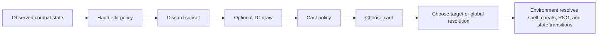
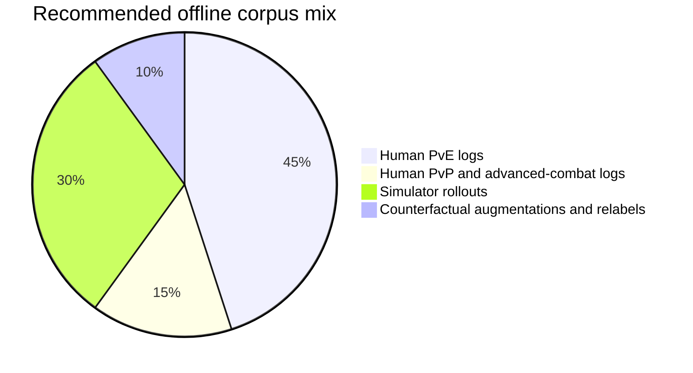
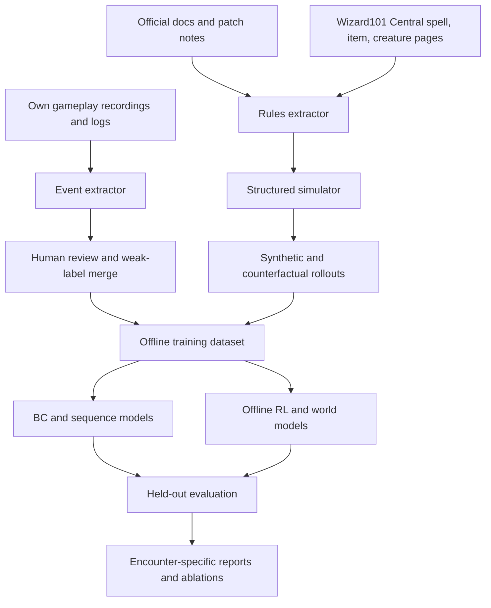

<!-- Design reference for the v0.3 simulator rebuild. Source
     citations were stripped in export; treat unmarked claims as
     community-sourced. -->

# Wizard101 Combat Mechanics and Offline ML Bot Design

## Executive Summary

Wizard101’s combat system is best modeled as a **partially observed, turn-based stochastic game** with a large but highly structured action space. Public official documentation covers the core resource system, deck construction, school identities, basic gear systems, jewel socketing, pets, shadow magic, archmastery, and several key mode differences between PvE and PvP. However, important implementation details remain either undocumented or only partially exposed through UI feedback and patch notes, especially around critical formulas, exact combat ordering in all contexts, enemy AI targeting, shadow-pip generation, boss cheat timing, and some status-immunity behaviors. Community-maintained sources such as Wizard101 Central therefore remain essential for spell-level data, creature stats, immunity flags, category taxonomies, and many mode or spell restrictions. Your offline training stack should therefore treat Wizard101 as a **rules engine plus learned nuisance-model problem**, not as a pure end-to-end policy-learning problem. citeturn19view0turn20view1turn28view0turn29view0turn33view1turn41view0

For implementation, the most robust path is to build a **factored simulator** driven by a structured spell database scraped from official/player-guide pages and community wikis, then learn policies over that simulator with offline data from compliant user recordings, hand-labeled logs, and simulator-generated rollouts. The highest-value design decision is to represent combat state **symbolically**: seats, health, pips, school pips, archmastery orb, hand, deck counts, visible sideboard state, active “hanging effects” with source IDs and protection flags, target resist/boost tables, known immunity flags, encounter rules, and cheat-trigger predicates. This symbolic layer should be paired with sequence models or graph networks to handle partial observability, hidden enemy deck composition, and long-horizon setup sequences such as blade-stack into AoE, trap-stack boss bursts, shield cycling, or advanced-combat roshambo/ramp-gambit interactions. Offline RL methods such as CQL and IQL are strong post-imitation candidates because they are designed for static datasets and distribution shift, while transformer-style policies and graph networks are natural fits for ordered trajectories and relational board states. citeturn42search0turn42search1turn42search2turn42search15turn43search0turn43search2turn43search3turn43search13

The most important caution is legal and operational: KingsIsle’s public rules and code-of-conduct materials explicitly prohibit cheats, hacks, exploit abuse, and unauthorized programs. That means the scope of this report is appropriate for **offline research, simulation, analysis, and benchmarking**, but not for live-service bot deployment, memory inspection, exploit development, or automation against the production game. If you proceed, the safest technical boundary is: use only public documentation, your own recordings, and manually or visually extracted data; do not rely on private servers, packet manipulation, reverse-engineered proprietary assets, or runtime automation against the live client. citeturn23search1turn32search2turn40search7

## Combat System Specification

### Core duel loop and turn structure

Official documentation describes Wizard101 as timed, turn-based card combat in which the player’s deck appears at duel start, spells are selected under a turn timer, and cards are either playable or greyed out based on current legality and resources. The public guide also confirms that treasure cards are accessed through a separate draw mechanic during battle, after discarding from hand. What is **not** fully specified publicly is the exact universal resolution algorithm for all battle contexts, including every ordering edge case in team fights, cheats, reactions, and simultaneous effect races. For an offline simulator, the correct abstraction is therefore: **selection phase under shared timer, then deterministic-but-version-sensitive resolution phase governed by seat order, mode rules, and cheat hooks**. citeturn21view0turn16search7turn16search11

In PvE, the official player guide states that if you engage a creature while alone, you are assigned to the first player position, and that the number of enemies scales with player count: in most of Wizard City, creatures match the number of players, while in Colossus Boulevard and later worlds, enemies equal players plus one up to a maximum of four. Community observations also indicate that first position frequently draws more enemy attention, and some players have documented enemy target switching based on damage or healing output, but KingsIsle does not publish a universal enemy-targeting formula. In practice, model **seat index**, **entry order**, **current threat proxy**, and **observed targeting history** as state features rather than hard-coding a single aggro law. citeturn22view3turn25search4turn16search4turn44search8

Official docs state that players receive **one pip per turn**, that power pips become available after level 10, and that power pips count as two pips toward spells in the wizard’s main school. Community and wiki sources further document extra starting pips from certain gear and wands, and item pages show examples of gear granting “+1 Power Pip at start of battle.” Because starting-pip rules can vary by equipment loadout, the simulator should not treat round-zero pip counts as a purely level-based constant; instead, it should infer them from equipment metadata and observed combat state. citeturn22view4turn15search2turn15search6turn35search19

### Accuracy, fizzles, pips, school pips, and shadow resources

The official guide and forum explanations establish that spell accuracy governs fizzles; if a spell fizzles, no critical or block calculation is performed. Public support/forum replies also indicate that displayed “100%” can historically be complicated by rounding or hidden modifiers in some contexts, while flat accuracy and positive/negative accuracy charms materially alter fizzle risk. For ML, the safe engineering choice is to treat hit chance as a **stochastic Bernoulli event conditioned on displayed spell accuracy, gear accuracy, and active accuracy charms/mantles**, while allowing for residual version noise if logs show non-zero error at apparently capped display values. citeturn20view1turn15search11turn15search15turn15search7

Archmastery and school pips are now central to modern Wizard101. Official Novus update notes explain that Archmastery fills a power orb that converts power pips into school-specific pips; if you have enough stored power and enough pips, you can generate multiple school pips in a round, and if you have at least three points stored and at least one white pip, the system can also convert white pips into power pips after school-pip conversion. The deck saves a preferred school-pip target, but the player can change the next generated school pip during combat. Official notes further state that in standard PvE, archmastery fill depends on relative Archmastery stat among combatants, while in PvP and other advanced combat, **deck fullness** also affects efficiency; later Selenopolis notes changed school-pip generation so it compares your Archmastery only against opponents, not teammates. These details are critical and must be explicit state variables in any modern simulator. citeturn29view0turn33view0turn33view1

Shadow magic is even less transparent. Official guides say trained shadow magic uses special shadow pips and carries backlash risk, and later update notes clarify that the shadow gauge UI shows **percentage of fill**, not the probability of receiving a shadow pip on the next turn. Public forum responses from KingsIsle support staff and community discussions indicate that exact shadow-pip appearance rates and fill behavior have changed over time and are not fully documented as a simple per-turn public formula. Therefore, a production-quality offline simulator should treat shadow gain as **version-specific and empirically fitted from logs**, not fixed from first principles. citeturn20view3turn28view0turn36search9turn36search12

### Damage, resist, pierce, critical, and hanging effects

The official gear guide states that critical chance and block chance are computed **after** fizzle/accuracy checks, and that charms, enchantments, wards, manipulations, and globals themselves are not subject to critical/block. The current public UI, as documented in the January 2023 update notes, exposes per-target critical chance, damage multiplier if you critical, and the target’s chance to block. KingsIsle forum posts from the 2021 stat rework period further clarify that critical damage is no longer a universal 2x and instead depends on attacker critical and defender block, while AoE criticals are effectively assessed per enemy rather than once for the whole cast. Since KingsIsle does not publish the modern closed-form formula in the player guide, your simulator should either estimate it from telemetry or defer to logged UI values when available. citeturn20view1turn28view0turn12search0turn12search4turn25search5

Damage and resist are now also mode-specific curve-based stats. Official January 2023 notes introduced different PvE and PvP intersections and limits for Damage and Resist, with Pierce applied to Resist before the new limit formulas. That means effective damage resolution is no longer a simple linear product of raw stat percentages at higher values. At minimum, a simulator must encode: base spell damage, school boost/weakness interactions, gear damage, active blades/traps/auras/globals, defender resist, attacker pierce, and current mode’s stat-limit function. Community creature pages additionally expose enemy outgoing damage, pierce, and incoming resist/boost values, which are useful when constructing public-enemy benchmarks. citeturn28view0turn24search0turn24search6

“Hanging effects” are the core board-state representation. Official and community sources divide spells into charms, wards, auras, enchantments, manipulations, healing, damage, all-enemy, all-ally, minion, and related categories. Community spell pages show concrete examples: Tower Shield is a ward, Elemental Blade is a charm, Feint is a ward that applies a positive trap to the enemy and a self-trap drawback, and Aegis/Indemnity/Sharpened Blade/Potent Trap are enchantments that modify or protect other hanging effects. Because stacking depends on **source identity and enchant state**, your simulator should store each effect as a structured object, not as a single scalar per school. citeturn26search1turn26search2turn26search3turn35search0turn35search1turn35search2turn34search0turn39search9

Community documentation and forum examples consistently indicate that blades and traps stack when they are **not the same card instance type**. A normal school blade can stack with an item-card blade, a pet-provided blade, and a Sharpened version; the same logic applies to traps with Potent Trap variants and some item/TC variants. Players also document the multiplicative nature of stacking on a base hit. This is a major implementation detail: learned policies only behave sensibly if the state tracks the provenance of each blade/trap and whether it is protected by Aegis or Indemnity. citeturn14search1turn14search5turn14search9turn35search5turn35search10turn35search35

### DoTs, HoTs, dispels, minions, defeat, and hidden mechanics

Fire’s official school identity is damage over time, and a long-standing developer/community note records that gear boosts apply to each DoT tick. Community spell pages also show hybrid HoT/manipulation examples such as Recuperation, which heals over time while removing a DoT, and advanced combat spells that convert effects rather than simply adding damage. For simulation purposes, every DoT and HoT should be represented as a **multi-round scheduled effect** with source school, tick count, per-tick magnitude, trigger timing, and interaction rules for detonation, cleansing, and conditional conversions. citeturn22view0turn27search30turn25search21turn37search18

Minions are explicitly part of the combat system. Official documentation describes Myth as the minion school, and community wiki pages define minion spells as manipulation spells that summon allies into the dueling circle. Because minions do not count as players for enemy-scaling in the official PvE encounter rules, but do create additional agents during combat, a simulator should treat them as dynamic actor nodes with their own decks, pips, school tags, and target policies. citeturn22view1turn22view3turn39search8turn39search13turn39search21

Defeat behavior is partially documented but context-sensitive. Official beginner documentation says health below zero defeats you and transports you to the world’s home location. Community reports, however, suggest that in some group-fight contexts a defeated wizard may still be healable before duel resolution ends, while other reports indicate post-defeat handling has changed over time. The safe conclusion is that **defeat and revival semantics are version- and context-dependent**, especially in team fights, so your dataset should log them explicitly rather than assuming a single immutable rule. citeturn44search3turn44search14turn44search1

A final category of “hidden mechanics” matters disproportionately for ML. First, many bosses use **cheats**, meaning out-of-turn or free interrupt casts that break normal tempo; official Selenopolis content now includes formal tutorials for combat cheats, and the official community-guides repository links large numbers of boss-cheat guides. Second, AoE spells may still require selecting a target even when they strike all enemies, which means target selection remains a real action variable. Third, multi-hit spells can consume shields or traps per component hit, as player guides for Hydra/Minotaur-style interactions document. Fourth, sideboard treasure-card draw is random, not targeted by exact card choice, and drawn treasure cards cannot be discarded the same round. All four of these details meaningfully affect a bot’s transition dynamics. citeturn33view1turn41view0turn25search9turn25search14turn38search14turn38search8turn38search16

## Spell and Deck Database Design

### What the spell database must contain

You should not try to encode Wizard101 as a hand-written list of “important” cards. The public wikis show thousands of spell pages and categories, including large category counts for manipulation spells alone. Instead, build a **canonical spell database** whose primary key is `(spell_name, variant_id, acquisition_type, mode_version)` and store every effect as an ordered list of primitives. Wizard101 Central spell pages already expose most of the static fields you need: school, pip cost, accuracy, spell type, PvP restriction level, and free-text effect description. School spell index pages and category pages provide convenient crawl seeds for broad coverage across schools and spell types. citeturn27search6turn26search15turn26search24turn39search4turn39search17turn39search19turn39search23

A robust effect primitive schema should include at least: `deal_damage`, `heal`, `drain`, `add_charm`, `add_ward`, `add_aura`, `add_global`, `add_dot`, `add_hot`, `summon_minion`, `convert_pips`, `remove_effect`, `steal_effect`, `detonate`, `stun`, `dispel`, `cleanse`, `swap_school`, `shift_form`, `draw_or_shuffle`, `modify_accuracy`, `modify_resist`, `modify_pierce`, `modify_critical`, `taunt`, `pacify`, and `cheat_interrupt`. Community spell pages show that even low-rank or school-standard cards often have multi-type classification, and advanced spells frequently combine damage with manipulation or ward logic. citeturn26search4turn26search36turn27search26turn27search30turn39search13

### Spell category comparison

The following table is the right level of abstraction for the offline simulator. It does **not** enumerate every spell; instead, it defines the categories your parser and environment must support. Category meanings are synthesized from official school/player-guide material and Wizard101 Central spell/category pages. citeturn19view0turn22view2turn26search29turn39search9

| Category | Typical target mode | Duration model | Example public source | Key ML implication |
|---|---|---:|---|---|
| Damage | Single enemy / all enemies | Instant or multi-hit | Thunder Snake, Lightning Bats citeturn26search0turn26search32 | Requires school, pip, accuracy, crit, resist, pierce |
| Healing | Self / ally / all allies | Instant or over time | Life school pages, Recuperation citeturn39search17turn27search30 | Must model overheal and ally targeting |
| Charm / Blade / Weakness / Mantle | Self / ally / enemy | Hanging effect until consumed/removed | Elemental Blade, Black Mantle references citeturn26search3turn27search5 | Source identity and stacking are critical |
| Ward / Trap / Shield / Prism | Self / ally / enemy / all | Hanging effect until consumed/removed | Tower Shield, Feint, Elemental Trap citeturn26search1turn26search2turn26search11 | Must track consumption order and protection |
| Aura | Self mostly | Fixed rounds | Conviction, Star-school guide citeturn27search0turn22view2 | Round countdown and non-stacking behavior |
| Global / Bubble | Whole field | Fixed rounds or until replaced | Official spell-audit bubble standardization citeturn28view0 | Global board feature affecting all actors |
| Enchantment | Applied to another spell | No board duration; modifies cast spell | Sharpened Blade, Potent Trap, Primordial, Aegis, Indemnity citeturn35search2turn34search0turn35search3turn35search0turn35search1 | Requires card-instance identity, not just spell class |
| Manipulation | Varies | Usually instant plus secondary effect | minion summons, many roshambo spells citeturn39search13turn27search6turn37search18 | Broad, compositional, often conditional |
| Minion / Summon | Self | Persists until defeated/removed | Myth school identity, minion categories citeturn22view1turn39search8turn39search6 | Adds actors and enlarges state graph |
| Polymorph / Shift | Self | Persistent until ended | Moon school guide citeturn22view2 | Swaps deck/stat profile; can redefine legal actions |
| Shadow / Pact / School-pip spells | Varies | Instant or aura-backed | Shadow guide, Novus archmastery notes citeturn20view3turn29view0 | Resource model must include shadow and school-specific pip costs |
| Ramp / Gambit / Roshambo | Varies | Conditional conversion or conditional payoff | Lemuria notes, ramps-and-gambits guide citeturn13search0turn37search18 | Best modeled as conditional effect graphs |

### Deck structure, treasure cards, and item cards

Official and community documentation together show three relevant deck channels: the main deck, treasure-card sideboard behavior, and gear/pet item cards. The official guide explains how treasure cards are loaded and drawn during battle after discarding from hand. Community explanations add that hand space effectively refills to seven cards, that treasure-card draws are random from sideboard inventory, and that a newly drawn treasure card cannot be discarded again until the next round. Separate forum guidance also states that gear and pet spells can be toggled so they do not automatically appear in the deck, meaning item-card loadout is itself a deck-building decision. citeturn21view0turn38search11turn38search14turn38search16turn18search15

For ML, this argues strongly for a **two-level deck representation**. One level stores full precombat deck configuration: main-deck multiset, sideboard multiset, item-card toggles, deck-specific preferred school pip, and deck legality restrictions. The second level stores combat-time draw state: visible hand, hidden main-deck counts, hidden sideboard counts, discard history, used-card history, and reshuffle events. Because treasure-card draw is stochastic and hand editing can happen before final cast selection, the agent’s action model should not collapse deck manipulation into a single undifferentiated “play spell” action. citeturn29view0turn18search15turn38search14turn38search12

### Recommended database schema

The database should be normalized enough to support simulator determinism, but not so fragmented that feature extraction becomes slow. A practical schema is below. The field names are implementation recommendations, while the required semantics come from official guide pages and Wizard101 Central spell infobox conventions. citeturn20view4turn26search0turn26search1turn26search2turn26search3

| Table | Key fields | Purpose |
|---|---|---|
| `spells` | `spell_id`, `name`, `variant`, `school`, `pip_generic`, `pip_school`, `pip_shadow`, `accuracy`, `target_mode`, `pvp_allowed`, `pvp_level_min` | Static spell identity |
| `spell_effects` | `spell_id`, `seq_idx`, `op_type`, `magnitude`, `school_tag`, `duration`, `condition_json`, `consumes_json`, `creates_json` | Ordered primitive-effect list |
| `spell_enchant_compat` | `spell_id`, `enchant_id`, `legal`, `notes` | Sharpen/Potent/Aegis/Indemnity/Primordial compatibility |
| `items` | `item_id`, `slot`, `level_req`, `stats_json`, `granted_cards_json`, `set_id`, `pin_slots_json`, `jewel_slots_json` | Gear metadata |
| `pets` | `pet_id`, `species`, `stats_json`, `talent_pool_json`, `granted_cards_json` | Pet combat contribution |
| `creatures` | `creature_id`, `school`, `health`, `starting_pips`, `resist_json`, `boost_json`, `crit`, `block`, `pierce`, `stunable`, `beguilable`, `cheat_script_id` | Enemy/minion metadata |
| `encounters` | `encounter_id`, `mode`, `world`, `boss_ids`, `minion_ids`, `advanced_combat_flags`, `version_tag` | Battle-specific rules |
| `cheat_scripts` | `cheat_script_id`, `trigger`, `priority`, `effect_json`, `public_source` | Interrupt-cast and reaction logic |
| `versions` | `version_tag`, `patch_date`, `mode_notes` | Patch-sensitive rule changes |

## Build Systems, Schools, Modes, and Hidden Rule Layers

### Gear, jewels, pins, pets, athames, amulets, decks, and set bonuses

Official equipment documentation names the main combat-relevant slots: wands, athames, amulets, rings, pets, and decks, with wands and amulets automatically supplying item-card spells and decks enforcing limits on maximum cards and copy counts. Official jewel-socketing pages add another layer for amulets, athames, rings, and decks, with up to four sockets of fixed shapes, level requirements for jewels, and one-time jewel destruction on shatter/removal. Official Novus notes then add the newer **pin** system for hats, robes, and boots, separating pins into Sword, Shield, and Power categories that emphasize offensive, defensive, and utility off-school stat support respectively. Newer official updates also refer to auctionable **set bonus gear**, new pinned level-60 gear, and continuing tuning of pin balance. citeturn20view0turn20view2turn29view2turn29view3turn17search9

Pets are effectively another equipment layer. The official pet guide states that pet statistics—Strength, Intellect, Agility, Will, and Power—feed duel-relevant talents such as damage, resistance, power pip chance, mana, and accuracy, and that some talents produce maycasts. Since pet progression and talent pools materially affect combat but are precombat configuration rather than in-combat choice, the clean modeling approach is to fold pet talent outputs into the actor stat block while also including **latent stochastic triggers** for maycasts if your simulator intends to reproduce them. If maycast rates cannot be estimated reliably from logs, they should be treated as optional stochastic augmentations or ignored for first-pass research. citeturn21view1turn21view2

### School identities and archetypes

KingsIsle’s official school descriptions still provide the cleanest high-level role taxonomy. Balance is the group-play support school with buffs and flexible mixed utility; Storm is high-damage, low-accuracy, low-health burst; Fire specializes in DoTs and stuns; Life is healing with high accuracy and moderate damage; Death is drain/self-sustain plus setup/debuff support; Ice is tanking, defense, and taunt; and Myth is minions plus shield-breaking and utility removal. Those role identities remain useful priors for policy design even though specific spell kits have expanded dramatically over time. citeturn22view0turn22view1

For ML, these school roles imply different **policy priors** and **reward structures**. Storm and Fire benefit from reward shaping that values kill thresholds and efficient setup-to-burst timing; Life and Ice benefit from survival- and prevention-oriented shaping; Death requires recognition of self-damage, drains, and tempo-negative setup that creates later board advantage; Myth requires minion and shield-removal reasoning; Balance requires broad utility handling, especially because balance support cards are widely cross-trained by other schools. This is one of the strongest arguments for either **school-conditioned policies** or separate specialist heads on top of a shared encoder. citeturn22view0turn22view1turn37search7

Recent official systems add a second layer beyond the classic seven-school identity. Novus introduced Archmastery and school-pip casting for dual-school play, and Selenopolis adds tutorials for the **Magic Wheel** and **Magic Weaving**, explicitly framing school relationships and blended-school progression as formal systems rather than purely emergent deck-building choices. In other words, a modern offline bot should not assume “primary-school-only” combat after midgame. It needs explicit support for school-pip requirements, mastery-amulet interactions, and blended/off-school loadouts. citeturn29view0turn33view1turn33view2

### PvE, PvP, advanced combat, and status immunities

Wizard101 no longer has one uniform combat ruleset. Official notes show different Damage and Resist curve settings for PvE and PvP, archmastery deck-fullness effects in PvP and advanced combat, season-based 5th Age PvP with level bands and anti-exploit sanctions, and continuing spell-audit standardization affecting blades, traps, bubbles, spears, and heal accuracy. Lemuria notes explicitly say the original roshambo spells were PvP-only when introduced. Selenopolis then goes further by stating that in **Advanced Combat**—defined there as PvP, raids, and challenge mode—stuns and AoE damage/DoT spells were removed from those modes in the affected combats. These mode flags are not cosmetic; they change legal action sets and must be encoded directly in the environment. citeturn28view0turn23search1turn13search0turn33view0

A practical mode abstraction is therefore:

| Mode family | Key public rule differences | Simulator consequence |
|---|---|---|
| Standard PvE | Normal archmastery fill; no deck-fullness penalty; encounter-specific cheats and creature stats | Broadest legal card set; best offline rollout domain |
| Ranked / advanced PvP | Different stat curves; deck fullness matters for archmastery; many spells have PvP restrictions or bans; season/leagues matter | Requires mode-conditioned legality masks and patch/version tags |
| Raids / challenge mode / advanced combat | Officially includes special removals like stuns and AoE damage/DoTs in listed advanced combats | Separate environment variant, not just a reward tweak |

This table is a synthesis of official patch notes and PvP update materials. citeturn28view0turn23search1turn33view0

Status immunities are one of the least standardized public surfaces. Community creature pages expose fields such as **Stunable** and **Beguilable**, and many players treat boss stun immunity as a rule of thumb, but the official player guide does not publish a single authoritative immunity framework covering every target type. Therefore, your simulator should distinguish three cases: `known_true`, `known_false`, and `unspecified`. Populate the first two from community creature pages and encounter guides; leave the third as null unless observed in logs. Do not infer universal boss immunities from folklore alone. citeturn24search0turn26search12turn24search4

## Offline Environment and State-Action Design

### Why Wizard101 is a POMDP, not a simple MDP

Even with perfect screen access, Wizard101 remains only partially observed. The player sees public board state, hand, visible pips, active effects, and some current UI probabilities, but does **not** fully observe enemy deck composition, enemy action policy, hidden cheat internals, exact future treasure-card draws, exact shadow-pip dynamics, or every patch-dependent combat formula. That makes offline modeling a **POMDP with heavy deterministic structure**. The right design is not a monolithic image policy, but a **symbolic observation encoder plus belief state** over hidden enemy resources and encounter scripts. citeturn28view0turn29view0turn36search9turn41view0

### Recommended state representation

A strong state representation should be factored into actor, board, deck, effect, encounter, and version subspaces.

| State block | Recommended fields |
|---|---|
| Self actor | school, level band, max/current HP, mana if relevant, generic pips, power pips, school pips by school, shadow pips/gauge, gear stat vector, pet stat vector, seat index, initiative side |
| Ally/enemy actors | same public combat stats where visible; for enemies include known creature template, resist/boost tables, starting pips, crit/block/pierce if available from public database, and uncertainty mask |
| Hand/deck | visible hand card IDs, enchant state, TC vs main-deck vs item-card provenance, hidden deck counts by card, sideboard counts, discard history, reshuffle count |
| Hanging effects | ordered multiset on each actor: effect type, magnitude, school tag, source ID, protected flag, rounds remaining, consumption priority key |
| Board globals | active bubble/global, encounter aura(s), mode flags, advanced-combat restrictions |
| Encounter metadata | world, encounter ID, boss-cheat script ID, known immunity flags, minion count, version tag |
| Temporal context | turn number, last 2–5 actions by each actor, last damage/heal values, recent targeting patterns |

This is an engineering recommendation, but it is tied directly to the public systems documented above: school pips, hidden deck state, effect provenance, mode flags, and encounter-specific cheat logic. citeturn29view0turn33view0turn18search15turn26search35

Two representation details matter more than most people expect. First, **effect provenance** must be retained. A +35% blade is not just “one more blade”; it may be a normal spell blade, a pet blade, an item-card blade, or a Sharpened blade, and those provenance differences determine stacking and protection behavior. Second, **seat and target identity** must be explicit. AoEs can still require target selection, first position often changes threat behavior, and many cheats are seat- or trigger-specific. If you compress these away, the policy will learn the wrong causal structure. citeturn14search5turn14search12turn25search9turn25search4

### Action space and action masking

The simplest correct abstraction is a **hierarchical action space**:

This hierarchy reflects the official treasure-card draw mechanic, the random sideboard draw process, and the fact that card manipulation and final casting are not the same choice. citeturn21view0turn38search14turn38search16

A practical action-space decomposition is below.

| Action family | Upper-bound size in standard 4v4 | Notes |
|---|---:|---|
| Pass | 1 | Always legal |
| Cast no-target card | up to `H_nt` | Self, aura, bubble, reshuffle, some summons |
| Cast single-enemy card | up to `4 * H_se` | Enemy seat selection required |
| Cast single-ally card | up to `4 * H_sa` | Includes self if legal |
| Cast all-enemies / all-allies | up to `H_aoe + H_team` | Some still require a UI-selected target |
| Hand discard subset | up to `2^H` raw, but learn autoregressively | With community-documented seven-card hand, raw subset count is 128 |
| TC draw count | bounded by open hand slots and available sideboard cards | Exact card drawn is stochastic, not chosen |
| Flee | 1 | Usually exclude from competitive policy learning, but keep for simulator completeness |

With a seven-card hand, the **final cast** branch is modest—usually a few dozen legal card-target pairs after action masking—but the **pre-cast deck manipulation** branch explodes combinatorially if treated monolithically. That is why hierarchical or autoregressive action modeling is the right choice. citeturn38search11turn38search16turn38search14

### Rewards and episode definitions

The cleanest episode definition is a single duel from initial board state to one of: friendly team victory, friendly team defeat, voluntary flee, forced mode termination, or hard simulator desync. Since Wizard101 fights vary drastically between quick mob battles and long cheat-boss encounters, you should keep **mode- and encounter-specific episode metadata** instead of training one untyped pool. citeturn22view3turn40search3turn40search9

For rewards, start with a sparse terminal objective—`+1` win, `0` draw/abort, `-1` loss—and add dense shaping only through auditable combat quantities. Good shaping features include net health swing, enemy removals, preserved ally health, effective pip use, successful execution of conditioned payoff spells, board-value change from adding/removing hanging effects, and penalties for illegal actions, wasted pips, or triggering known bad cheats. In advanced combat modes, add explicit penalties for choosing action categories made illegal by the mode’s restrictions. This reward layout is an engineering recommendation, but it is directly aligned with Wizard101’s public combat semantics and mode differences. citeturn33view0turn28view0

## Offline Data Pipeline and Annotation

### Data sources and legality-safe collection

Given the restriction against private servers and proprietary code access, your data program should combine three sources only: **public documentation**, **your own compliant gameplay recordings/logs**, and **rollouts from a rules-faithful simulator built from those public sources**. Official guides and patch notes provide core system rules; Wizard101 Central provides spell, item, creature, and category detail; and the official community-guides portal explicitly points players to community strategy and guide ecosystems, which is useful for encounter coverage and cheat validation. citeturn19view0turn41view0turn26search15turn39search4

A reasonable starting corpus mix is shown below. This is a recommendation, not a published standard.

Human logs are needed for realistic hand-edit behavior, cheat adaptation, and deck-building priors; simulator rollouts are needed for coverage and counterfactual analysis; small augmentation pools help balance rare schools, niche encounter mechanics, and rare spell conditions. This aligns with the offline-RL literature’s emphasis on diverse static datasets and benchmark-aware dataset construction. citeturn43search3turn43search11

### Logging schema and annotation rules

Use a turn-event schema, not just a summary schema. The minimum useful record is a **stepwise transition**:

| Field | Type | Annotation rule |
|---|---|---|
| `episode_id`, `turn_id`, `step_id` | identifiers | Unique per duel / turn / atomic event |
| `version_tag`, `mode_tag`, `encounter_id` | categorical | Must be recorded before modeling |
| `actor_id`, `team`, `seat` | categorical | Stable across duel |
| `obs_state_json` | structured | Publicly visible state only |
| `believed_hidden_state_json` | structured optional | Human or model estimate; keep separate from truth |
| `action_phase` | enum | `discard`, `draw_tc`, `cast`, `cheat_interrupt`, `resolve_tick`, etc. |
| `action_id`, `target_id` | categorical | Final chosen card and target |
| `rng_event_json` | structured | fizzle, critical proc, block proc, random TC draw, random minion spell, etc. |
| `state_delta_json` | structured | Health, pips, effects added/removed, actor defeat, summon, global change |
| `legal_mask_hash` | checksum | Reconstructible legality mask for debugging |
| `source_confidence` | float / enum | `official`, `community-confirmed`, `observed-only`, `inferred` |

The most important annotation principle is **do not silently convert unknowns into zeros**. If an enemy’s exact block stat or cheat priority is unknown, store null and mark confidence. Public creature pages can provide weak labels for creature stats and immunity flags, while player recordings provide ground truth for observed transitions only. citeturn24search0turn26search12turn41view0

### Labeling guidelines

For outcome labels, record at least: duel result, turns elapsed, surviving allies, surviving enemies, total damage dealt/taken, total healing output, boss-cheat triggers, and whether the run was “clean” with respect to pre-specified tactical rules such as “no illegal action,” “no dead-card cast attempt,” or “no avoidable cheat trigger.” Because combat is sequential, it is also worth labeling **strategic phases** for a smaller expert subset: setup, tempo-stabilize, shield cycle, burst window, cleanup, anti-cheat reset, and desperation heal stall. These labels are not required for the simulator, but they can materially improve imitation-learning and interpretability. citeturn40search4turn40search15

For spell semantics, do not rely only on free text. Parse the spell page into machine primitives, then use human review only to resolve ambiguous conditionals, advanced roshambo effects, or cheat-trigger interactions. The final human review checklist should ask: `What does this spell consume? What does it create? What are the durations? Is it protected? Is it multi-hit? Does each component retarget or re-evaluate? Is it legal in PvP/advanced combat?` That checklist is precisely where Wizards’ community spell pages and mode flags are most valuable. citeturn26search29turn37search18turn33view0

### Data engineering pipeline

## Models, Training Algorithms, and Evaluation

### Baselines and model families

Start with baselines that are easy to debug. The first baseline should be **behavior cloning** over `(state, legal_mask) -> (card, target)` for standard PvE only. The second should add the hand-edit phase. The third should add recurrence or short-horizon sequence context. If these baselines do not beat trivial scripted policies on mob fights and simple bosses, do not move to offline RL yet. This is not a literature claim so much as a strong engineering recommendation, but it is consistent with offline-RL practice: stable behavior from static data is hard enough before you add value learning. citeturn42search0turn42search1turn43search3

After that, three model families are especially well suited here:

| Model family | Why it fits Wizard101 | Good use case |
|---|---|---|
| Policy/value MLP with symbolic features | Fast, interpretable, easy legal masking | Early PvE baselines |
| Sequence model / Transformer | Long setup sequences, partial observability, deck/history dependence | Mid/late-game boss fights, advanced combat |
| Graph network | Multiple actors, minions, per-actor effects, relational targeting | Team fights, minion-heavy fights, cheat bosses |

Sequence-model approaches are directly supported by offline RL literature like Decision Transformer and Trajectory Transformer, while graph networks fit Wizard101’s actor-effect-seat relational structure unusually well. citeturn42search2turn43search2turn42search15

A very strong architecture candidate is a **hybrid graph-sequence model**: encode the current board as a graph whose nodes are actors plus active globals, encode structured hanging effects as typed edges or per-node multisets, then feed per-turn graph embeddings into a causal transformer over the last `K` turns. The policy head then predicts `(discard policy, draw policy, cast card, target)` with strict action masks. This combines relational inductive bias with long-horizon temporal memory, which is exactly the combination Wizard101 demands. citeturn42search15turn42search2turn43search2

### Training algorithms

For imitation learning, behavior cloning is the minimum viable start, and DAgger-style aggregation is the natural next step if you later add expert correction inside the simulator. Ross et al.’s DAgger framework specifically addresses compounding errors in sequential prediction, which is relevant because small mistakes in Wizard101—such as the wrong discard, wasting a sharpen, or tripping a cheat—cascade badly over later turns. citeturn43search13

For offline RL fine-tuning on a static corpus, **CQL** and **IQL** are the best default candidates. CQL is attractive when you want conservative value estimation and strong protection against out-of-distribution overestimation; IQL is attractive when you want policy improvement without explicitly evaluating unseen actions. Both are well aligned with Wizard101 because the legal action surface is large, datasets are policy-biased, and off-support action values will otherwise be brittle. citeturn42search0turn42search1turn42search5

For model-based learning, **MOPO** is the most directly relevant cited baseline in this report because it is designed for offline RL with uncertainty-aware rollout penalties. If your simulator is incomplete—likely, given undocumented formulas and cheat edge cases—a learned world model plus uncertainty penalties can still be useful, especially for generating training rollouts in well-covered regions of the state space. However, do not let a learned world model replace the deterministic rules engine where public rules are known. Use it only for residual stochasticity or hidden-state forecasting. citeturn43search0turn43search8

### Suggested hyperparameters

These are implementation recommendations, intended as starting points rather than claims about Wizard101-specific optima.

| Component | Suggested starting range |
|---|---|
| Symbolic embedding dim | 256–512 |
| Transformer layers | 6–8 |
| Attention heads | 8 |
| Sequence context | 32–64 turns or atomic events |
| GNN message-passing steps | 3–5 |
| Optimizer | AdamW |
| Learning rate | `1e-4` to `3e-4` |
| Batch size | 512–2048 step samples or 32–128 trajectories |
| Discount factor | `0.99` for duel-level returns |
| CQL conservative weight | sweep 0.1, 1.0, 5.0 |
| IQL expectile | sweep 0.7, 0.8, 0.9 |
| Early stopping metric | held-out win rate in simulator, not just action accuracy |

### Evaluation metrics, baselines, and ablations

Use evaluation at three levels.

First, **supervised fidelity**: legal-action accuracy, top-k action accuracy, target accuracy conditional on card, hand-edit accuracy, and calibration of action probabilities. These tell you whether the model understands expert play patterns.

Second, **simulator performance**: win rate, average turns to victory, average incoming damage, overheal rate, pip-efficiency score, shield/trap/blade utilization rate, and cheat-trigger violation count. These measure actual game competence.

Third, **robustness and generalization**: transfer from one world to another, one school to another under conditioning, one patch version to another, and one mode family to another. Because D4RL and related offline-RL benchmark work stress dataset properties and distribution mismatch, you should report results stratified by data regime rather than as a single global score. citeturn43search3turn43search15

Your baseline suite should include at least: a tiny greedy scripted policy, pure BC, BC + sequence context, BC + graph encoder, IQL, CQL, Decision Transformer, and a hybrid graph-transformer + IQL or CQL fine-tune. Decision Transformer is especially worth testing because Wizard101 has long delayed payoffs—setup now, hit later—and that is exactly the kind of temporal credit assignment sequence models are meant to absorb. citeturn42search2turn43search10turn42search0turn42search1

Ablations should be ruthless. Remove one element at a time and measure the drop:

| Ablation | What it tests |
|---|---|
| No effect provenance | Whether stacking-source identity matters |
| No seat/position features | Whether threat/targeting and lane effects matter |
| No encounter/version tag | Whether patch and boss-specific mechanics are being memorized incorrectly |
| No sequence context | Whether setup timing needs history |
| No graph structure | Whether relational encoding beats flat concatenation |
| No hand-edit model | Whether discard/TC usage is essential |
| No mode legality mask | Whether the model is overfitting to impossible actions |

If you only run one ablation, run **no effect provenance**. In Wizard101, collapsing all blades, traps, shields, and protections into flat totals is one of the fastest ways to build a policy that looks competent offline and fails catastrophically in real resolution order.

## Legal, Safety, and Scope Boundaries

KingsIsle’s public code-of-conduct materials tell players to read the Terms of Use for more detailed legal and in-game policies, and public KingsIsle-facing forum replies explicitly say that cheats, hacks, modding, cheat engines, and non-KI programs used to play Wizard101 are not allowed. Official PvP update notes also warn that boosting or exploit abuse can lead to sanctions, including rank adjustments and account bans. On that basis, the correct safe scope for this project is: **offline simulator research, theory, dataset curation, and benchmark evaluation only**. Do not deploy against the live game, and do not build features whose only purpose is to evade detection, automate the production client, or manipulate the service. citeturn32search2turn32search4turn40search7turn23search1

A compliant research workflow is straightforward. Use public official docs and patch notes for rule scaffolding. Use Wizard101 Central and other officially linked community guides for spell, item, creature, and encounter metadata. Use your own recordings and hand-labeled logs to validate transitions. Use simulator rollouts to scale training. Keep all version tags explicit, because modern Wizard101 combat changes through spell audits, mode restrictions, archmastery tuning, pin updates, and advanced-combat removals. If you later want a real-time assistant for personal theorycrafting, keep it strictly **advisory/offline** rather than automated. citeturn41view0turn28view0turn29view0turn33view0

The most actionable final recommendation is this: treat Wizard101 as a **structured symbolic domain with learned uncertainty modules**. Build the rules engine first. Build the spell/item/creature database second. Train BC on symbolic states third. Add offline RL only after the deterministic simulator reproduces public mechanics and held-out human logs. That sequencing matches both the public information landscape of Wizard101 and the offline-RL literature’s core lesson: good static-data performance depends more on disciplined problem formulation than on throwing a larger model at an underspecified environment. citeturn42search0turn42search1turn43search3
---

## Addendum (July 2026): School stat anchors and the boss-AI model

A second merged research report (user-provided, July 2026) grounds two
sim layers. What it verifies, at its own confidence grades:

**Player base stats.** Level 1 / level 120 base-health anchors per
school (official-forum quoted; Storm 400→2343 … Ice 500→4204) and the
universal base power-pip rule (0% before level 10, ~1 point/level to
the 40% base cap at 50). The report is explicit that (a) linearity
between the anchors is NOT proven, and (b) practical combat stats
(damage, resist, accuracy, critical, block, pierce) are gear-dominated
with no defensible base curve. `player_curves.py` implements exactly
this much: exact anchors, linear interpolation tagged as
approximation, clamped (not extrapolated) past 120, and no fabricated
combat-stat curves. The 0.85 power-pip figure used by endgame
experiments is a geared value, not a base one.

**Boss casting.** The report's best-supported model is three layers:
configured spell pool/deck + state-aware-but-imperfect legal-action AI
+ deterministic encounter scripts — with NO public evidence of a
player-like hand/draw model, exact selection weights, or multi-turn
planning. The sim maps one-to-one:

| Report layer                    | Sim implementation                |
|---------------------------------|-----------------------------------|
| Configured pool (reusable)      | `Boss.pool` card names; no hidden |
|                                 | hand/deck simulated               |
| Legal-action AI, role archetypes| `_enemy_choose`: pip legality,    |
| (hitter/healer/buffer/debuffer/ | duplicate-hanging checks,         |
| tank), passing as a real action | archetype priority buckets, pass  |
| Weighted/unknown selection      | `Boss.discipline`: P(follow role  |
|                                 | priorities) vs uniform legal pick |
| Deterministic scripts           | the existing `CheatRule` layer —  |
|                                 | the report validates this design  |
| Threat/position targeting       | existing threat-based             |
|                                 | `_resolve_targets` for team 1     |

Everything above the report's evidence line is tagged `modeled`,
itemized: enemy power-pip odds (`Boss.pip_chance`, default 0.40 = the
player base cap), the discipline default (0.7), the archetype
priority orders, the player-rule transplants (fizzle keeps pips; the
7-slot rack cap with white→power upgrade when full — the upgrade is
also the escape hatch that keeps a saving hitter from freezing into
a forever-pass), and enemy healers routing heals to the neediest
living teammate. Boss casts route through the same charm/ward/crit/
fizzle engine as player casts — including consuming incoming
accuracy charms (player-cast mantles) and dispels, so player debuff
counterplay works against the caster. Known limitation: enemy
ally-targeted BUFFS still resolve to self (heals were fixed to
follow the healer's decision), so the buffer archetype self-blades
rather than blading a teammate.
